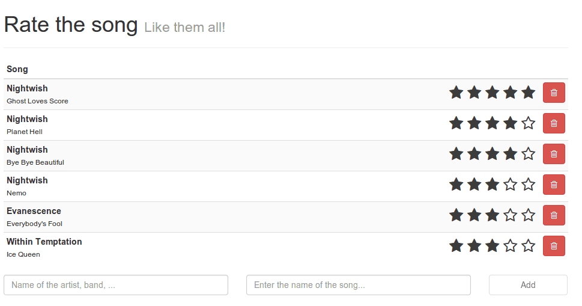

If you're a developer for the past five years you may have noticed an explosion in the JavaScript world. Suddenly frameworks, concepts, standards and building tools are popping everywhere. The browser is becoming a valuable alternative to desktop applications and if you didn't already hop on to the JavaScript train towards the future, then it's time to do so!

In this tutorial series I will give you a small introduction to Ember.js. We're not going to build something super fancy, but with this example I hope you're going to be able to understand various concepts of Ember.js like:

- Router and routes
- Models, stores and adapters
- Controllers
- Handlebars templates and helpers
- Components and views

If you complete this tutorial series, then you're ready to start developing your own apps, as the basics will always stay the same. The app we're going to build in this series is a small CRUD application where the user can add and delete songs to a list. He can also give a score to the song by using a selfmade rating widget. The list of songs will be sorted based on these scores. The best thing is that all data is persisted to the HTML5 LocalStorage, meaning that if you reload the page, the songs will still be there!

A demonstration of the app can be found on [Github](http://song-rate-mvc.github.io/ember-song-rate), as well as the [code](http://github.com/song-rate-mvc/ember-song-rate).

### Ember.js in action: The series

1. [Ember.js in action: Routes and controllers](/ember-routes-controllers/ "Ember.js in action: Routes and controllers")
2. [Ember.js in action: Helpers and adapters](/ember-helpers-adapters/ "Ember.js in action: Helpers and adapters")
3. [Ember.js in action: Components and views](/ember-components-views/ "Ember.js in action: Components and views")

**Hint:** If you're interested in building an app using AngularJS, you can also view the [original series](/introduction-angularjs/ "Introduction to AngularJS") about me developing the same app, but using AngularJS.
