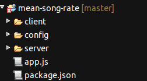
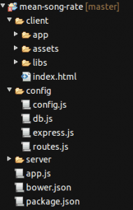
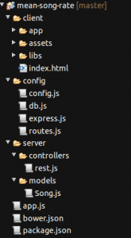

In an earlier article/tutorial series I told you how you could create your own application using AngularJS and the HTML Local storage to persist the data. If you missed it, be sure to check it out [here](http://wordpress.g00glen00b.be/introduction-angularjs/ "Introduction to AngularJS"). The local storage is great but what if we want to persist the data somewhere inside a database and share that information across all clients?

In this tutorial I will convert the app I wrote using AngularJS to make it use the MEAN stack. Don't worry, there's nothing mean about the MEAN stack. The MEAN stack is a pure JavaScript stack containing:

- **MongoDB**: MongoDB is a NoSQL database allowing you to store JSON (actually BSON) documents and query them. This is a great database when going for pure JavaScript applications because it's easy to put the same object structure that you're working with, inside the database.
- **Express**: Express is a web framework that runs on Node.js. A "web" framework may sound a bit vague, but it is actually that. It allows you to serve static content, it allows you to route certain requests to execute certain logic (great for RESTful webservices) and so on.
- **AngularJS**: I probably don't have to explain this one to you, but AngularJS is a client-side Model-View-Controller framework by Google.
- **Node.js**: I mentioned it already that we're going to use Node.js (because we're going to use Express), but Node.js is a JavaScript platform, quite popular nowadays. In this tutorial we will use it as our server-side platform.

### Prerequisites

Before starting with the application, you obviously need to install the MEAN stack. If you followed some of my other tutorials, you probably already used Node.js and npm to use Bower. If you didn't install Node.js yet, you can get it from [nodejs.org](http://nodejs.org). By installing Node.js you install two things; first of all it will install Node.js (obviously), and second it will also install the Node.js package manager called npm.

Verify that the installation was successful by using the command:

node --version

or:

nodejs --version

And to check if npm was installed, use:

npm --version

The second step is to install MongoDB, which you can download from [mongodb.org](http://mongodb.org). To check if the installation was successful, use:

mongod --version

### Setting up our application

The first step is that we're going to setup our application. Start a new project and add the following folders:

- **client**: This folder will contain our client-side application using AngularJS. This content will be served by Express.
- **config**: This folder will contain configuration used to run our application. Things like a connection URL and the port we will run on can be setup here. It's a good idea to centralize this information for when you want to dpeloy the app on a cloud based environment.
- **server**: This folder will contain our server-side logic to serve the client and to provide a RESTful webservice.

We're also going to add some files. First of all we're going to create our Node.js application by creating a file called **app.js**. Node.js also comes with a packaage manager called **NPM**. To load our dependencies, we will have to define a file called **package.json**, which will define our application and the dependencies we have. In our app the file will contain:

{
  "name": "mean-song-rate",
  "version": "0.0.1",
  "dependencies": {
    "mongoose": "~3.6.14",
    "express": "~3.3.4"
  }
}

I already explained what we're going to do with Express. **Mongoose** on the other hand is a Node.js framework used to communicate with MongoDB. It provides a sweet API where you use models to add/update/retrieve and read your data.

 

#### Client

For the client-side part of our application, I'm going to start of where we left in my previous tutorial. I'm not going into detail about AngularJS controllers, services or directives in this tutorial. If you're interested in that, I suggest reading my introduction [tutorial series](http://wordpress.g00glen00b.be/introduction-angularjs/ "Introduction to AngularJS") to AngularJS.

What we do need is the code of the application, which you can find on [Github](https://github.com/song-rate-mvc/angular-song-rate) ([master.zip](https://github.com/song-rate-mvc/angular-song-rate/archive/master.zip)). Put all the code in the client folder, except **bower.json** and **.bowerrc** which you can put in the root folder.

Now open up **.bowerrc** and change the `directory` to:

{
  "directory": "client/libs",
  "json": "bower.json"
}

This is obviously necessary because we moved our Bower configuration one level up (to the parent folder).

Now open **bower.json** and add the dependency **angular-resource**, for example:

{
  "name": "mean-song-rate",
  "version": "0.0.1",
  "dependencies": {
    "angular": "1.2.15",
    "angular-resource": "1.2.15",
    "bootstrap": "3.1.1",
    "lodash": "2.4.1",
    "underscore.string": "2.3.3",
    "font-awesome": "4.0.3"
  }
}

Angular-resource is a part of the AngularJS framework and provides an easy way to integrate with your RESTful webservices.

Also note that I changed the name in the bower configuration.

#### Configuration

The next part is the configuration. Open the **config** folder and add the following files:

- **config.js**: This file will contain our main configuration including port number and database URL.
- **db.js**: This file will contain the Mongoose configuration to connect to our MongoDB instance.
- **express.js**: This file will contain the configuration used for Express.js like on which port it has to un, which context will be used to serve our client application and which context will be used to provide our RESTful webservices.
- **routes.js**: Finally we will also use the routing pattern to setup which URL is bound to which logic in our controller.

#### Server

The serverside logic will not be too complicated. We're going to add two folders here called **controllers** and **models**.

In the controllers folder we will add our RESTful webservice controller, called **rest.js**. In the models folder we will add our model, a file called **Song.js**.

### Writing your Node.js app

Now all files are ready, so let's start by writing our application. I'm going to start with the boring stuff first, namely the configuration part.

Let's open up **config.js** and add the following code:

var env = process.env.NODE\_ENV || 'development';

var config = {
  port: 3000,
  db: 'mongodb://localhost/songs',
  host: 'localhost'
};

module.exports = config;

On the first line we're retrieving a system variable called `NODE_ENV`. This is not really important in our app, but if you want to deploy this on a cloud environment like IBM BlueMix or if you want to host this on multiple environments, you might be interested in this. For every environment you choose another value for `NODE_ENV`, which will allow you to use something like:

if (env === "production") {
  config.db = 'mongodb://my.production.server/songs';
}

So, on the next lines we can see our configuration which contains:

- **port**: The port our application will run on
- **db**: The MongoDB connection string
- **host**: The hostname the application will run on

And finally we make sure that this module returns `config`, so when another module calls it, it gets the configuration object. You can do this by using `module.exports`.

The next configuration file is **db.js**. Similar to config.js we will configure Mongoose and return the configuration by using `module.exports`, for example:

var mongoose = require('mongoose');

module.exports = function(config) {
  mongoose.connect(config.db);
  var db = mongoose.connection;

  db.on('error', function() {
    throw new Error('Unable to connect to database at ' + config.db);
  });
};

So, here we're using the configuration object we made in our previous module and use it to connect to MongoDB using Mongoose. The configuration itself is passed as an argument to this module, I will show you how that works later.

Then the next configuration file is **express.js**, similar to db.js it will configure our application based upon the configuration from config.js.

var express = require('express');

module.exports = function(app, config) {
  app.configure(function () {
    app.use(express.compress());
    app.set('port', config.port);
    app.use(express.logger('dev'));
    app.use(express.bodyParser());
    app.use(express.methodOverride());
    
    app.use('/api', app.router);
    app.use('/', express.static(\_\_dirname + "/../client"));
  });
};

So, what happens here is that this module accepts two parameters, `app` which is an application object initialized by Express and second we have `config` which is our configuration object which we're going to need to know the port we're going to run on.

So, let's talk about each line more into detail. The first two lines of configuration are pretty easy, the first line makes sure that our files are compressed using the GZIP protocol and the second line says which port we're going to use.

The third line (`app.use(express.logger('dev'));` makes sure that we're going to log all requests of both our RESTful webservice as the static files that are served.

The next two lines are important for our RESTful webservice In our RESTful webservice we're going to use the post body to add or update the objects. To do that we need to enable the `express.bodyParser()`) on our application. The `express.methodOverride()` on the other hand allows us to use `PUT` and `DELETE` requests, which we will use to update and delete our objects in our RESTful webservice.

Then finally we configure our app to use `/api` to serve our RESTful webservice and `/` to provide the static files from the client folder.

The last configuration file is **routes.js** and this is probably the easiest one. In this configuration file we will define which REST endpoint is mapped to which method in our controller.

var rest = require('../server/controllers/rest');

module.exports = function(app){

  // find all songs route
  app.get('/songs', rest.findAll);
  
  // find one song route
  app.get('/songs/:id', rest.findOne);
  
  // Add song route
  app.post('/songs', rest.add);
  
  // Update song route
  app.put('/songs/:id', rest.update);
  
  // Delete song route
  app.del('/songs/:id', rest.remove);
};

As you can see here, we're using several endpoints here:

- **GET /songs**: This will be used to retrieve all songs in our database
- **GET /songs/:id**: The `:id` is a placeholder for the real ID of a song. Which means that we're going to use this to retrieve a single song from our database.
- **POST /songs**: This method will be used to add a new song to the list. The song itself will be provided as JSON in the post body of the request.
- **PUT /songs/:id**: This method will be used to update a song by its ID. The updated song itself will be provided in the request body, just like adding new songs.
- **DELETE /songs/:id**: This method will be used to delete a song by its ID.

At the first lien you can see how we import our REST controller in the configuration file by using `require('../server/controllers/rest')`.

### The main application

Before actually writing our application we have to write the "glue" that keeps all modules together. Our main module (**app.js**) will import the configuration files to make sure our app is properly started. The code itself is not that complex, as it's sole purpose is to load other modules (like our configuration).

So, first of all we're going to import all modules that we need by using the `require()` function:

var express = require('express'), mongoose = require('mongoose'), fs = require('fs'), http = require('http'),
    config = require('./config/config'), root = \_\_dirname, app = express(), server = null;

Most of these modules are known by now. Only `fs` and `http` are new modules. These are standard modules of Node.js, so that's why you won't find them in package.json. The names of the modules already explain what they do:

- **fs**: Provides functions to access the file system
- **http**: Allows you to create a HTTP web server

Then the next step is that we're going to configure Mongoose by using db.js:

require('./config/db')(config);

As you can see here, we're importing the module and immediately after it we're executing the function and providing the `config` argument.

The next part is a bit more complex. To dynamically load all our models, we're going to list all files in the models directory and add all modules that are inside that folder. We can do that by writing:

var modelsPath = \_\_dirname + '/server/models';
fs.readdirSync(modelsPath).forEach(function (file) {
  if (file.indexOf('.js') >= 0) {
    require(modelsPath + '/' + file);
  }
});

Now we only have the express and route configuration file left, which we're going to load by writing:

require('./config/express')(app, config);
require('./config/routes')(app);

And finally we need to start the webserver itself, which we will do by adding:

var server = http.createServer(app);
server.listen(config.port, config.host);
console.log('App started on port ' + config.port);

This is everything we have to do to make our application work. In the next part I'm going to explain how we're going to create the MVC application using Express and how we're going to tweak the AngularJS application to make it work with our new RESTful webservice.

### Working with the MEAN stack

1. [Node.js application setup](http://wordpress.g00glen00b.be/mean-application-setup/)
2. [MVC using Express and AngularJS](http://wordpress.g00glen00b.be/mean-mvc/)
