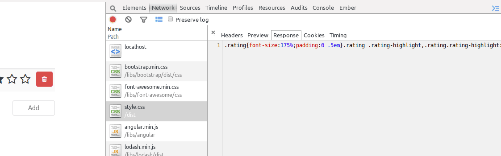

In [my previous tutorial](/angular-grunt/ "Making your AngularJS application grunt") I explained how you could use Grunt to create a nice and easy build environment. We did stuff like checking our code quality using JSHint, concatenated and minified files, ran our unit tests, ... Most of these changes didn't require any change to our code (except the location of our freshly built JavaScript file). In this example I'm going to use the same app and rewrite the CSS code made in the first part of the tutorial to use Less. But first of all, what is Less? LESS is a CSS pre-processor, similar to what CoffeeScript is to JavaScript (in case you're familiar with CoffeeScript). It goes further where CSS stops and adds features like mixins, variables, functions, hierarchical structures and much, much more. So basically... Less is MORE!

### Project setup

I'm going to start of with the code from [my previous tutorial](/angular-grunt/ "Making your AngularJS application grunt") where we used Grunt to improve building our application. Check out the source code so you're using the same codebase as I do and nothing could go wrong. The next step is that we're going to add a package to our package descriptor, so let's open **package.json** and add the following:

```json
"grunt-contrib-less": "~0.11.3"
```

Then update your Node.js packages by using the command:

```
npm install
```

Now, rename your **assets/css** folder into **assets/less** and rename **style.css** into **style.less**.

### Variables

Less allows you to use variables in your code, for example:

```less
@black: '#000000';

.test {
  color: @black;
}
```

Which would compile into:

```css
.test {
  color: black;
}
```

Taking a look at our CSS code, we see that we're using two colors: `#F4914E` and `#3C3C3C`, so let's convert these into variables:

```less
@orange: #F4914E;
@dark-grey: #3C3C3C;

.rating {
  font-size: 175%;
  padding: 0 0.5em;
}

.rating > a {
  text-decoration: none;
}

.rating .rating-highlight, .rating.rating-highlight:hover {
  color: @orange;
}

.rating .rating-normal, .rating.rating-normal:hover {
  color: @dark-grey;
}
```

We can also use the variables for other stuff as well, for example we could use it to change the font size, padding, ... .

### Nested selectors

Another key feature of Less is the use of nested selectors. An example of it is:

```less
.parent {
  .child {
    color: #000;
  }
}
```

Which would compile into:

```css
.parent .child {
  color: #000;
}
```

While using these nested rules, you could also use the ampersand sign (`&`) to get the parent selector, for example:

```less
.parent {
  & > .child {
    color: #000;
  }
}
```

Which would result into:

```css
.parent > .child {
  color: #000;
}
```

So, if we use these nested selectors on our style, we could write something like:

```less
@orange: #F4914E;
@dark-grey: #3C3C3C;

.rating {
  font-size: 175%;
  padding: 0 0.5em;
  
  & > a {
    text-decoration: none;
  }
  
  & .rating-highlight, &.rating-highlight:hover {
    color: @orange;
  }
  
  & .rating-normal, &.rating-normal:hover {
    color: @dark-grey;
  }
}
```

Everything is relative towards `.rating`, so we could use that as the parent selector.

### Mixins

Another feature of Less is the use of mixins. Mixins allow you to re-use certain logic. A use case it's often used in is for using vendor-specific selectors, for example:

```less
.border-radius(@radius) {
  -webkit-border-radius: @radius;
     -moz-border-radius: @radius;
          border-radius: @radius;
}

.test {
  .border-radius(2px);
}
```

Which compiles into:

```css
.test {
  -webkit-border-radius: 2px;
     -moz-border-radius: 2px;
          border-radius: 2px;
}
```

If we look at our code, we notice that these parts are almost exactly the same:

```less
& .rating-highlight, &.rating-highlight:hover {
  color: @orange;
}
  
& .rating-normal, &.rating-normal:hover {
  color: @dark-grey;
}
```

The main difference is the color and the classname they apply to. So, we could in fact write a mixin for this:

```less
@orange: #F4914E;
@dark-grey: #3C3C3C;

.color-hover-mixin(@class; @color) {
  .@{class}, &.@{class}:hover {
    color: @color; 
  }
}

.rating {
  font-size: 175%;
  padding: 0 0.5em;
  
  & > a {
    text-decoration: none;
  }
  
  .color-hover-mixin(~'rating-highlight', @orange);
  .color-hover-mixin(~'rating-normal', @dark-grey);
}
```

The tilde sign (`~`) means that the expression is escaped, so that when used inside the mixin, the proper classname is used (in stead of using a string).

### Import directive

We can also split our code up into multiple files using `@import`. For example, we could create a seperate file containing our variables and mixins, so they could be re-used in other Less files as well. So, let's create a file called **general.less** and move the following code into it:

```less
@orange: #F4914E;
@dark-grey: #3C3C3C;

.color-hover-mixin(@class; @color) {
  .@{class}, &.@{class}:hover {
    color: @color; 
  }
}
```

Now you can refer to these variables and mixins by using the following line of code in **style.less**:

```less
@import 'general.less';
```

### Gruntify Less

We talked about most of the key features of Less and Lessified our CSS code. So now it's time for us to integrate the Less compilation inside our build process. Open **Gruntfile.js** and make sure that the grunt-contrib-less plugin is loaded by adding the following to it:

```javascript
grunt.loadNpmTasks('grunt-contrib-less');
```

Now we can add the following task:

```javascript
less: {
  dev: {
    options: {
      paths: [ "assets/less" ]
    },
    files: {
      "dist/style.css": "assets/less/style.less"
    }
  },
  dist: {
    options: {
      paths: [ "assets/less" ],
      cleancss: true
    },
    files: {
      "dist/style.css": "assets/less/style.less"
    }
  }
}
```

Just like we did with some other tasks as well, we defined two less tasks, called **less:dev** and **less:dist**. The last one will also minify the CSS file using clean-css.

We also have to change some other tasks as well, like the watch-task, which should now also watch for changes in our Less files:

```javascript
watch: {
  dev: {
    files: [ 'Gruntfile.js', 'app/*.js', '*.html', 'assets/**/*.less' ],
    tasks: [ 'jshint', 'karma:unit', 'html2js:dist', 'concat:dist', 'less:dev', 'clean:temp' ],
    options: {
      atBegin: true
    }
  },
  min: {
    files: [ 'Gruntfile.js', 'app/*.js', '*.html', 'assets/**/*.less' ],
    tasks: [ 'jshint', 'karma:unit', 'html2js:dist', 'concat:dist', 'less:dist', 'clean:temp', 'uglify:dist' ],
    options: {
      atBegin: true
    }
  }
}
```

I changed the `files` to include all Less files and I also changed the tasks a bit, because now it should also include the proper less task as well.

Another task I changed is the compress file, because now it no longer needs the assets directory:

```javascript
compress: {
  dist: {
    options: {
      archive: 'dist/<%= pkg.name %>-<%= pkg.version %>.zip'
    },
    files: [{
      src: [ 'index.html', 'dist/*.js', 'dist/*.css', 'libs/**' ]
    }]
  }
}
```

_Note: I noticed that the syntax used in previous tutorial wasn't entirely correct, so I fixed it here._

Now we only have to change the package task, so it also includes our Less compile task:

```javascript
grunt.registerTask('package', [ 'bower', 'jshint', 'karma:unit', 'html2js:dist', 'concat:dist',
  'uglify:dist', 'less:dist', 'clean:temp', 'compress:dist' ]);
```

Now it should work fine, however, we also have to change the location of the CSS file in our HTML file, so open **index.html** and replace the style.css piece with:

```html
<link rel="stylesheet" href="dist/style.css" />
```

### Testing it out

Everything should work now, so let's test it out by using the command:

```
grunt dev
```

Now open the application in your web browser and you will see that the Less code is rendered well:


Using the command:

```
grunt minified
```

will result in the minified version.



So that means everything is working fine.

#### Achievement: Lessified your Angular app using Grunt

Seeing this means you finished the Get more with Less using Grunt tutorial. If you're interested in the full code example, you can find it on [GitHub](https://github.com/song-rate-mvc/angular-song-rate/tree/0.0.4). If you want to try out the code yourself, you can download an archive from [Github](https://github.com/song-rate-mvc/angular-song-rate/archive/0.0.4.zip).
