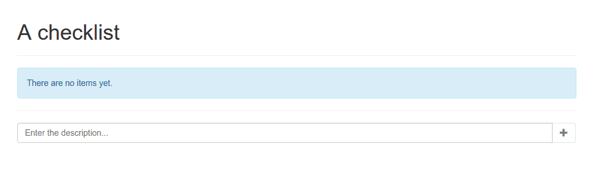
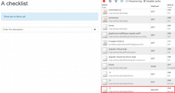

Recently I wrote several "exotic" applications using WebSockets. If you're not into WebSockets, but you're interested in using Spring and AngularJS, this article may suite you. In this example I will setup a web project using the Spring framework and an in memory embedded HSQL database. The client-side of the application will be written using AngularJS. Let's start!

### Project setup

I'm gonna start of with a simple Maven webproject, in my **pom.xml** I will have to add the following dependencies:

```xml
<dependency>
    <groupId>org.springframework</groupId>
    <artifactId>spring-webmvc</artifactId>
    <version>4.1.1.RELEASE</version>
</dependency>
<dependency>
    <groupId>org.springframework.data</groupId>
    <artifactId>spring-data-rest-webmvc</artifactId>
    <version>2.2.0.RELEASE</version>
</dependency>
<dependency>
    <groupId>org.springframework.data</groupId>
    <artifactId>spring-data-jpa</artifactId>
    <version>1.7.0.RELEASE</version>
</dependency>
<dependency>
    <groupId>org.hibernate</groupId>
    <artifactId>hibernate-entitymanager</artifactId>
    <version>4.3.6.Final</version>
</dependency>
<dependency>
    <groupId>org.hsqldb</groupId>
    <artifactId>hsqldb</artifactId>
    <version>2.3.2</version>
</dependency>
<dependency>
    <groupId>javax.servlet</groupId>
    <artifactId>javax.servlet-api</artifactId>
    <version>3.1.0</version>
    <scope>provided</scope>
</dependency>
```

I will also need several front-end dependencies, I will use Bower to manage them:

```json
{
    "name": "ng-spring-data",
    "dependencies": {
        "angular": "~1.3.0",
        "angular-spring-data-rest": "~0.3.0",
        "bootstrap-css-only": "~3.2.0",
        "lodash": "~2.4.1"
    }
}
```

To change the location of where Bower installs the libraries, I'm also going to add a **.bowerrc** folder to the root of my project, containing the following:

{
    "directory": "src/main/webapp/libs",
    "json": "bower.json"
}

If you're asking yourself why we need all these libraries, well, here's a description of why:

- **spring-webmvc**: The Web MVC framework will be used for having the MVC pattern for loading our web application.
- **spring-data-rest**: The Spring Data REST framework allows us to create RESTful webservices of our model quite easily using Spring HATEOAS.
- **spring-data-jpa**: Spring Data JPA is used to create JPA enabled repositories from our models, allowing you to use the repository pattern to work with your data.
- **hibernate-entitymanager**: JPA provides a cool API, but to actually use it, you will need an implementation like Hibernate or OpenJPA. In this case I'm going to use Hibernate, so I need this library as well.
- **hsqldb**: For storing our data we will be using an in memory HSQLDB. We also need to be able to connect to it, so we also use this library for having our JDBC driver.
- **javax.servlet-api**: To use JavaConfig we will need the servlet-api 3, and to use it in our code, we will have to add it as well. However, the web container will usually have this one as well, so we've set the scope to provided for this one.

Then we're also using several front-end libraries:

- **angular**: AngularJS allows us for using the MVC pattern for the client-side part of the application.
- **angular-spring-data-rest**: AngularJS has great integration with REST API's, however, the integration with HATEOAS based RESTful webservices is less, so we will need to use an external library for that.
- **bootstrap-css-only**: We don't want to waste a lot of time setting up the user interface of the application, so using a UI library like Bootstrap, Foundation or Semantic UI really helps.
- **lodash**: JavaScript is great, but there are several tools which you will use a lot that aren't available out of the box, so it's a good idea to have a utility belt library with you like Lo-Dash or Underscore.js.

### WebAppInitializer

Modern webapps no longer contain files like web descriptors or Spring bean configuration files. With JavaConfig you can properly replace your web descriptor with a class. The contents will look similar to those of a web descriptor though:

```java
public class WebAppInitializer extends AbstractAnnotationConfigDispatcherServletInitializer {

  @Override
  protected void customizeRegistration(ServletRegistration.Dynamic registration) {
    registration.setInitParameter("dispatchOptionsRequest", "true");
    registration.setAsyncSupported(true);
  }

  @Override
  protected Class<?>[] getRootConfigClasses() {
    return new Class<?>[] { AppConfig.class };
  }

  @Override
  protected Class<?>[] getServletConfigClasses() {
    return new Class<?>[] { WebConfig.class };
  }

  @Override
  protected String[] getServletMappings() {
    return new String[] { "/" };
  }

  @Override
  protected Filter[] getServletFilters() {
    CharacterEncodingFilter characterEncodingFilter = new CharacterEncodingFilter();
    characterEncodingFilter.setEncoding(StandardCharsets.UTF_8.name());
    return new Filter[] { characterEncodingFilter };
  }
}
```

We still have servlets, mappings and filters. In this case I'm gonna map a servlet to the root path and have the class `WebConfig` handle the web context (similar to what `springmvc-servlet.xml` did in the past). The application context is also replaced and now we have a class called `AppConfig` which replaces the `applicationContext.xml` file.

Finally I also added a filter that makes sure that everything is encoded as **UTF-8**. If you don't do that, you may get some strange responses when having special characters.

### Setting up the application context

We have to implement two other configuration files called `AppConfig` and `WebConfig`. The first one, `AppConfig`, contains mostly the configuration for setting up the datasource and the entity manager:

```java
@Configuration
@EnableJpaRepositories(basePackages = { "be.g00glen00b.repository" })
@ComponentScan(basePackages = "be.g00glen00b", excludeFilters = {
    @ComponentScan.Filter(value = Controller.class, type = FilterType.ANNOTATION),
    @ComponentScan.Filter(value = Configuration.class, type = FilterType.ANNOTATION)
})
public class AppConfig extends RepositoryRestMvcConfiguration {
  
  @Override
  protected void configureRepositoryRestConfiguration(RepositoryRestConfiguration config) {
    super.configureRepositoryRestConfiguration(config);
    try {
      config.setBaseUri(new URI("/api"));
    } catch (URISyntaxException e) {
      e.printStackTrace();
    }
  }

  @Bean
  public DataSource dataSource() {
    return new EmbeddedDatabaseBuilder().setType(EmbeddedDatabaseType.HSQL).build();
  }

  @Bean
  public JpaVendorAdapter jpaVendorAdapter() {
    HibernateJpaVendorAdapter adapter = new HibernateJpaVendorAdapter();
    adapter.setShowSql(true);
    adapter.setGenerateDdl(true);
    adapter.setDatabase(Database.HSQL);
    return adapter;
  }

  @Bean
  public LocalContainerEntityManagerFactoryBean entityManagerFactory() throws ClassNotFoundException {
    LocalContainerEntityManagerFactoryBean factoryBean = new LocalContainerEntityManagerFactoryBean();
    factoryBean.setDataSource(dataSource());
    factoryBean.setPackagesToScan("be.g00glen00b.model");
    factoryBean.setJpaVendorAdapter(jpaVendorAdapter());
    factoryBean.setJpaProperties(jpaProperties());

    return factoryBean;
  }

  @Bean
  public JpaTransactionManager transactionManager() throws ClassNotFoundException {
    JpaTransactionManager transactionManager = new JpaTransactionManager();
    transactionManager.setEntityManagerFactory(entityManagerFactory().getObject());

    return transactionManager;
  }

  @Bean
  public Properties jpaProperties() {
    Properties properties = new Properties();
    properties.put(HBM2DDL_AUTO, "create-drop");
    return properties;
  }
}
```

Let's see what this class contains. Starting from the top we notice several annotations to enable features in our application. First of all we have `@EnableJpaRepositories` to indicate we're going to use Spring Data JPA and that we have our repositories inside the package `be.g00glen00b.repository`.

Also, we have to scan all packages for beans, which we do by using the `@ComponentScan` annotation. However, we don't have to scan controllers, since they're part of the web context and neither doe we have to scan configuration files, because they have to be loaded in a different way. That's why we add them to the exclusion filter (`excludeFilters`).

Then, when looking at the class, you can see we're inheriting from `RepositoryRestMvcConfiguration`. This allows us to create RESTful resources from our repositories.

This also means we have to override the `configureRepositoryRestConfiguration()` method, in which we can define the root path of these RESTful resources.

The other methods like `dataSource()`, `jpaVendorAdapter()`, `entityManagerFactory()`, `transactionManager()` and `jpaProperties()` are used for setting up our datasource and JPA.

### Setting up the web context

We're now able to create RESTful webservices, however, our application also has a user interface, so we will have to configure our web context as well using `WebConfig`:

```java
@Configuration
@EnableWebMvc
@ComponentScan(basePackages = "be.g00glen00b.controller")
public class WebConfig extends WebMvcConfigurerAdapter {

  @Bean
  public InternalResourceViewResolver getInternalResourceViewResolver() {
    InternalResourceViewResolver resolver = new InternalResourceViewResolver();
    resolver.setPrefix("/WEB-INF/views/");
    resolver.setSuffix(".jsp");
    return resolver;
  }

  @Override
  public void configureDefaultServletHandling(DefaultServletHandlerConfigurer configurer) {
    configurer.enable();
  }

  @Bean
  public WebContentInterceptor webContentInterceptor() {
    WebContentInterceptor interceptor = new WebContentInterceptor();
    interceptor.setCacheSeconds(0);
    interceptor.setUseExpiresHeader(true);
    interceptor.setUseCacheControlHeader(true);
    interceptor.setUseCacheControlNoStore(true);

    return interceptor;
  }

  @Override
  public void addResourceHandlers(ResourceHandlerRegistry registry) {
    registry.addResourceHandler("/libs/**").addResourceLocations("/libs/");
    registry.addResourceHandler("/app/**").addResourceLocations("/app/");
    registry.addResourceHandler("/assets/**").addResourceLocations("/assets/");
  }

  @Override
  public void addInterceptors(InterceptorRegistry registry) {
    registry.addInterceptor(webContentInterceptor());
  }
}
```

Starting from the top again, you can see that we use the `#EnableWebMvc` annotation to indicate that we're using Spring Web MVC.

Our class extends from `WebMvcConfigurerAdapter` which allows us to add interceptors (`addInterceptors()`) and resource handlers (`addResourceHandlers()`).

We're adding the `webContentInterceptor()` interceptor that allows use to set cache controlling. The resource handlers are used to indicate which paths should be used to serve static resources. In this case it will be the **libs**, **app** and **assets** folder.

Then finally, we also have to create a bean called the `getInternalResourceViewResolver()` bean. This bean is used when defining controllers so that it's able to resolve the location of the view used inside the controller.

### Adding a controller

Speaking of a controller... let's implement it now we're busy. Make sure that you're adding the controller to the `be.g00glen00b.controller` package, because that's the location used inside the component scan of the `WebConfig`.

The controller itself is quite easy, it has only one method, used to load the main application page:

```java
@Controller
@RequestMapping("/")
public class AppController {

  @RequestMapping(method = RequestMethod.GET)
  public String viewApplication() {
    return "index";
  }
}
```

As you can see, it's a quite simple method, that only returns the string `"index"`. Returning in a string means that we're using a view called **index** which matches the file **/WEB-INF/views/index.jsp** thanks to the `getInternalResourceViewResolver()` bean in our configuration.

### Defining the model

The application I'm going to build will be a simple todo application, but if you're interested in building something else, you simply define another model.

A todo item can have a description and it can be checked or unchecked. We also need to add an ID, which will be used to know which todo item we're talking about.

The model will eventually look like this:

```java
@Entity
public class Item {

  @Id
  @GeneratedValue(strategy=GenerationType.IDENTITY)
  private int id;
  
  @Column
  private boolean checked;
  
  @Column
  private String description;

  public int getId() {
    return id;
  }

  public void setId(int id) {
    this.id = id;
  }

  public boolean isChecked() {
    return checked;
  }

  public void setChecked(boolean checked) {
    this.checked = checked;
  }

  public String getDescription() {
    return description;
  }

  public void setDescription(String description) {
    this.description = description;
  }
}
```

Make sure you add this class to the `be.g00glen00b.model` package, because this is the only package we said to scan inside the `entityManagerFactory`.

### Creating the heart of our application, the repository

All we have to do now is to create a repository based upon the model. Creating a repository with the Spring Data JPA framework is quite easy though, we only have to define a simple interface like this:

```java
@RepositoryRestResource(collectionResourceRel = "items", path = "items")
public interface ItemRepository extends PagingAndSortingRepository<Item, Integer> {

}
```

This adds our JPA repository and enables it for REST as well. If you deploy your application now and open your web browser, you can already access the REST API by going to:

http://localhost:8080/ng-spring-data/api/items

In this case **/ng-spring-data** is my content root and I'm running my web container on **http://localhost:8080**.


### Working at the front-end

Before we start with writing JavaScript code, we have to create the HTML page first. As I mentioned before, we mapped the controller so that when the application is opened, the **/WEB-INF/views/index.jsp** file is used as the view. So, let's write that file. The content is quite simple:

```html
<!DOCTYPE html>
<html lang="en">
  <head>
    <link rel="stylesheet" href="./libs/bootstrap-css-only/css/bootstrap.min.css" />
  </head>
  <body ng-app="myApp">
    <div class="container" ng-controller="AppController">
      <div class="page-header">
        <h1>A checklist</h1>
      </div>
      <div class="alert alert-info" role="alert" ng-hide="items && items.length > 0">
        There are no items yet.
      </div>
      <form class="form-horizontal" role="form" ng-submit="addItem(newItem)">
        <div class="form-group" ng-repeat="item in items">
          <div class="checkbox col-xs-9">
            <label>
              <input type="checkbox" ng-model="item.checked" ng-change="updateItem(item)"/> {{item.description}}
            </label>
          </div>
          <div class="col-xs-3">
            <button class="pull-right btn btn-danger" type="button" title="Delete"
              ng-click="deleteItem(item)">
              <span class="glyphicon glyphicon-trash"></span>
            </button>
          </div>
        </div>
        <hr />
        <div class="input-group">
          <input type="text" class="form-control" ng-model="newItem" placeholder="Enter the description..." />
          <span class="input-group-btn">
            <button class="btn btn-default" type="submit" ng-disabled="!newItem" title="Add">
              <span class="glyphicon glyphicon-plus"></span>
            </button>
          </span>
        </div>
      </form>
    </div>
    <script type="text/javascript" src="./libs/angular/angular.min.js"></script>
    <script type="text/javascript" src="./libs/angular-resource/angular-resource.min.js"></script>
    <script type="text/javascript" src="./libs/angular-spring-data-rest/dist/angular-spring-data-rest.min.js"></script>
    <script type="text/javascript" src="./libs/lodash/dist/lodash.min.js"></script>
    <script type="text/javascript" src="./app/app.js"></script>
    <script type="text/javascript" src="./app/controllers.js"></script>
    <script type="text/javascript" src="./app/services.js"></script>
  </body>
</html>
```

As you can see, most of it is simple HTML with some Twitter Bootstrap classes. However, you will also notice some other attributes like `ng-app` and <code>ng-controller. These are AngularJS directives which contain the logic for translating this HTML template into the actual HTML visible in the application.

#### Bootstrapping AngularJS

First of all, we have the `ng-app` attribute, indicating that we have to bootstrap AngularJS in our application and allows us to pass it a name so that we can configure which application modules that should be used. A few lines below we find the `ng-controller="AppController"` attribute. This means that that part of the application is controller by a controller named `AppController`.

The `ng-controller` attribute does refer to an AngularJS controller, not a Spring MVC controller!

#### Hiding components

The next AngularJS directive has a bit more logic and shows the real power of these directives. The `ng-hide` directive allows you to hide specific elements if the expression passed to it validates to `true`. In this case we're using it to show a message in case there is no todo item yet, so I wrote the following: `ng-hide="items && items.length > 0"`. This means that the `items` model should exist and should not be empty.

We can use the model in all our directives. For example, to loop over all items inside the `items` model we use the `ng-repeat` directive, for example `ng-repeat="item in items"`, which means that all the elements will be repeated for each item.

#### Model binding

The most beautiful part of AngularJS is the possibility to have two way binding. For example, if you have a textfield, you often need the value of the textbox inside a variable in JavaScript. In AngularJS you can bind a textbox to a model (= JavaScript property in the controller), so that each time you enter a character in the textbox, the model is updated. The **two** in two way binding makes the opposite possible as well. If you change the model directly, the value in the textbox will also update. To bind the model to a form element we use the `ng-model` directive, for example `ng-model="item.checked"`.

#### Event handling

We can do most things now, except that we have to handle events. If we're adding new items to the todo list, we want to capture the submit event on our form. We can do that by using the `ng-submit` directive.

If you want to track changes, you can also use the onChange event by using the `ng-change` directive, like you can see on the checkbox. You can also use the `ng-click` directive to handle clicks, like we did on the delete button.

The functions we pass to these directives are functions defined in our controller.

### Defining the controller

As you may have noticed now, the controller is the heart of our applications that controls all the small blocks in our application (= the directives).

As you may have noticed from the JSP page, we're including three scripts we didn't define until now: `app.js`, `controllers.js` and `services.js`.

In `controllers.js` we will define our controller, the `AppController`:

```javascript
(function(angular) {
  var AppController = function($scope, Item) {
    Item.query(function(response) {
      $scope.items = response ? response : [];
    });
    
    $scope.addItem = function(description) {
      new Item({
        description: description,
        checked: false
      }).save(function(item) {
        $scope.items.push(item);
      });
      $scope.newItem = "";
    };
    
    $scope.updateItem = function(item) {
      item.save();
    };
    
    $scope.deleteItem = function(item) {
      item.remove(function() {
        $scope.items.splice($scope.items.indexOf(item), 1);
      });
    };
  };
  
  AppController.$inject = ['$scope', 'Item'];
  angular.module("myApp.controllers").controller("AppController", AppController);
}(angular));
```

As you can see here, we can find all the methods we used in our JSP page. For example, we have the functions `updateItem()`, `deleteItem()` and `addItem()` which we used in the event handling.

We also find the `items` model, called `$scope.items` and the `newItem` model called `$scope.newItem`.

Important to notice here is that we have no HTML code here. If we're deleting a todo item, all we have to do is to delete it from the list of items, (which is why we use the `splice()` function in `deleteItem()`).

We can also update form elements by updating the model, if you look at `addItem()`, you can see that we use `$scope.newItem = ""`, which will erase the contents of the textbox using `ng-model="newItem"``.`

As you can see, most of the things we do, have to do with the `Item` object. This object is injected into the controller. AngularJS allows you to inject modules into other modules, which we're using here to inject the Item factory.

### Using HATEOAS in the Item factory

What you may have noticed when viewing the REST API is that you get a lot of additional data, for example:

```json
{
  "_links" : {
    "self" : {
      "href" : "http://localhost:8080/ng-spring-data/api/items{?page,size,sort}",
      "templated" : true
    }
  },
  "page" : {
    "size" : 20,
    "totalElements" : 0,
    "totalPages" : 0,
    "number" : 0
  }
}
```

This is called HATEOAS (Hypermedia as the Engine of Application State). Like I said before, AngularJS does not have support for this out of the box (nor in their **angular-resource** project).

So, to allow us to use it without polluting the controller, we abstracted it away into a separate factory, so let's open `services.js`.

The code of this factory is a bit more complex, so let's split it into smaller parts first.

First of all we have to create the module itself, for example:

```javascript
(function(angular) {
  var HATEOAS_URL = './api/items';
  var ItemFactory = function($http, SpringDataRestAdapter) {
    function Item(item) {
      return item;
    }
    
    return Item;
  };
  
  ItemFactory.$inject = ['$http', 'SpringDataRestAdapter'];
  angular.module("myApp.services").factory("Item", ItemFactory);
}(angular));
```

This looks quite similar to the setup of the controller, except the fact that we're using a function prototype here called `Item`.

#### Querying the RESTful webservice

Before we start implementing the prototype, I'm going to add a "static" function called `query()` which will access the API and return a list of items:

```javascript
Item.query = function(callback) {
  var deferred = $http.get(HATEOAS_URL);
  return SpringDataRestAdapter.processWithPromise(deferred).then(function(data) {
    Item.resources = data._resources("self");
    callback && callback(_.map(data._embeddedItems, function(item) {
      return new Item(item);
    }));
  });
};
```

Item.resources = null;

We're using the `$http` module to execute an AJAX request to the REST API and then convert the response using the **angular-spring-data-rest** module. Then we're using the `Item` prototype to create new instances of it.

We're also saving the resources into `Item.resources`.

#### Prototyping Item

The next step is to create the prototype of `Item`. If we look back at the controller, we can see that it should have two functions called `save()` and `remove()`.

The `save()` function has two purposes in this case. When we're creating a new item in `addItem()`, we're using it to add the new item. However, in `updateItem()` we're updating an already existing item.

To make a difference between these two, we verify if the item has resources, by using `item._resources`. If the factory created the Item, it will have these resources. However, if the controller made the Item, it will not have them, allowing us to provide other implementation details for the `save()` functionality.

So if we look at the `Item` prototype it will have this structure:

```javascript
function Item(item) {     
  if (item._resources) {
    item.save = function(callback) { };
        
    item.remove = function(callback) { };
  } else {
    item.save = function(callback) { };
  }

  return item;
}
```

#### Saving new items

First of all, let's write the `save()` function in case there are no resources. If the item itself has no resources, it has to add the todo item. However, Spring HATEOAS does not provide a response when adding the item, but it does provide the `Location` header, containing a link to the HATEOAS response of the new item.

So, we came up with writing something like this:

```javascript
item.save = function(callback) {
  Item.resources.save(item, function(item, headers) {
    var deferred = $http.get(headers().location);
    return SpringDataRestAdapter.processWithPromise(deferred).then(function(newItem) {
      callback && callback(new Item(newItem));
    });
  });
};
```

It uses the `Item.resources`, because these resources tell us what the URL is for saving new items. After saving, we use the headers to retrieve the location header, by using `headers().location` and we use `$http` to call it using AJAX.

The response has to be promised using **angular-spring-data-rest, similar to how we did inside the `query()` function, only this time it's for handlign only one item.**

#### Updating and deleting existing items

Each item individually has separate `_resources`, which will tell us what URL to use to update and delete the songs. So, updating and deleting is quite simple:

```javascript
item.resources = item._resources("self", {}, {
  update: {
    method: 'PUT'
  }
});
item.save = function(callback) {
  item.resources.update(item, function() {
    callback && callback(item);
  });
};
        
item.remove = function(callback) {
  item.resources.remove(function() {
    callback && callback(item);
  });
};
```

Putting everything together in the factory we get:

```javascript
(function(angular) {
  var HATEOAS_URL = './api/items';
  var ItemFactory = function($http, SpringDataRestAdapter) {
    function Item(item) {
      
      if (item._resources) {
        item.resources = item._resources("self", {}, {
          update: {
            method: 'PUT'
          }
        });
        item.save = function(callback) {
          item.resources.update(item, function() {
            callback && callback(item);
          });
        };
        
        item.remove = function(callback) {
          item.resources.remove(function() {
            callback && callback(item);
          });
        };
      } else {
        item.save = function(callback) {
          Item.resources.save(item, function(item, headers) {
            var deferred = $http.get(headers().location);
            return SpringDataRestAdapter.processWithPromise(deferred).then(function(newItem) {
              callback && callback(new Item(newItem));
            });
          });
        };
      }

      return item;
    }
    
    Item.query = function(callback) {
      var deferred = $http.get(HATEOAS_URL);
      return SpringDataRestAdapter.processWithPromise(deferred).then(function(data) {
        Item.resources = data._resources("self");
        callback && callback(_.map(data._embeddedItems, function(item) {
          return new Item(item);
        }));
      });
    };
    
    Item.resources = null;
    
    return Item;
  };
  
  ItemFactory.$inject = ['$http', 'SpringDataRestAdapter'];
  angular.module("myApp.services").factory("Item", ItemFactory);
}(angular));
```

### Defining the application packages

The last file that's left is the `app.js` file, defining the packages `myApp`, `myApp.controllers` and `myApp.services`:

```javascript
(function(angular) {
  angular.module("myApp.controllers", []);
  angular.module("myApp.services", []);
  angular.module("myApp", ["ngResource", "spring-data-rest", "myApp.controllers", "myApp.services"]);
}(angular));
```

The name of the `myApp` module is the same name we have to enter when bootstrapping the application (`ng-app="myApp"`). The array we're using as the second parameters is the list of module it depends on. In this case the controllers and services are not depending on any other modules, however, the application itself needs the ngResource, spring-data-rest, the controllers and the services modules to work.

### Demo

That's it for the development of the application. As you can see the amount of Java code we had to write was pretty small, even configuring the application took us longer than actually writing the code. The JavaScript side was a bit more complex, but I hope to see more support for HATEOAS in the future in AngularJS. I tried to make it run similar to how angular-resource works, but that came with a cost for implementing such a factory.

But let's try out the application. If you deployed it in your web container, you should be able to see the following application in your web browser.



If you add a new item, you will see that two network requests are sent, one for adding the item and another one for retrieving the contents of that item.


Checking or unchecking a task will send a PUT request for updating the item:


And finally, deleting will send a DELETE request:



That's it for this tutorial. You're now able to write web applications using Spring MVC, Spring Data REST and AngularJS.

#### Achievement: Built modern webapps using Spring Data REST and AngularJS

Seeing this means you managed to read through the entire tutorial about developing modern webapps using Spring Data REST and AngularJS. If you're interested in the full code example, you can find it on [GitHub](https://github.com/g00glen00b/ng-spring-data). If you want to try out the code yourself, you can download an archive from [Github](https://github.com/g00glen00b/ng-spring-data/archive/master.zip).
