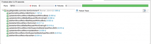
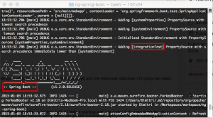
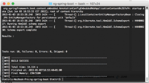

In my [previous article](http://wordpress.g00glen00b.be/prototyping-spring-boot-angularjs/ "Rapid prototyping with Spring Boot and AngularJS") I explained how you could rapidly create a completely working, responsive CRUD application with about 150 lines of code. That's obviously nice, but [Spring Boot](http://projects.spring.io/spring-boot/) also makes it easy to write integration tests for your application, because it's easy to setup a running test application with a few annotations, so then you can use your favourite testing framework (for example [REST-assured](https://code.google.com/p/rest-assured/)) to test your REST API.

So, let's get started with this tutorial!

### Maven configuration

#### Plugins

I'm going to write some unit tests and integration tests as well. To do that, I'm going to use the **maven-surefire-plugin** for executing my unit tests and the **maven-failsafe-plugin** to execute the integration tests.

This is the setup I'm going to use:

<plugin>
  <artifactId>maven-surefire-plugin</artifactId>
  <configuration>
    <skipTests>${unit-tests.skip}</skipTests>
    <excludes>
      <exclude>\*\*/\*IT.java</exclude>
    </excludes>
  </configuration>
</plugin>
<plugin>
  <artifactId>maven-failsafe-plugin</artifactId>
  <executions>
    <execution>
      <id>integration-test</id>
      <goals>
        <goal>integration-test</goal>
      </goals>
      <configuration>
        <skipTests>${integration-tests.skip}</skipTests>
        <includes>
          <include>\*\*/\*IT.class</include>
        </includes>
      </configuration>
    </execution>
  </executions>
</plugin>

As you can see, in the surefire configuration, I'm excluding all tests ending with `*IT.java`, because these will be my integration tests. In the failsafe configuration on the other hand I'm including those tests, so that all integration tests will run while executing that plugin.

#### Profiles

You certainly don't want to run your integration tests each time you're compiling because they can be rather slow. So, to be able to separate these tests, I introduced two properties called `${unit-tests.skip}` and `${integration-tests.skip}`.

Let's add them to the `<properties>` list:

<properties>
  <unit-tests.skip>false</unit-tests.skip>
  <integration-tests.skip>true</integration-tests.skip>
</properties>

Ok, now I'm going to add an integration profile that will set the `${integration-tests.skip}` to `false`. To do that, add the following to your Maven configuration:

<profiles>
  <profile>
    <id>integration</id>
    <properties>
      <unit-tests.skip>false</unit-tests.skip>
       <integration-tests.skip>false</integration-tests.skip>
    </properties>
  </profile>
</profiles>

#### Dependencies

The next step is to add some dependencies. I'm going to write some unit tests using [Mockito](http://mockito.org/) and [AssertJ](http://joel-costigliola.github.io/assertj/), while I'm going to use [REST-assured](https://code.google.com/p/rest-assured/) for my integration tests. These are the dependencies I will have to add:

<dependency>
  <groupId>org.springframework.boot</groupId>
  <artifactId>spring-boot-starter-test</artifactId>
  <scope>test</scope>
</dependency>
<dependency>
  <groupId>junit</groupId>
  <artifactId>junit</artifactId>
  <scope>test</scope>
</dependency>
<dependency>
  <groupId>org.assertj</groupId>
  <artifactId>assertj-core</artifactId>
  <version>${assertj.version}</version>
</dependency>
<dependency>
  <groupId>org.mockito</groupId>
  <artifactId>mockito-all</artifactId>
  <version>${mockito.version}</version>
</dependency>
<dependency>
  <groupId>com.jayway.restassured</groupId>
  <artifactId>rest-assured</artifactId>
  <version>${rest-assured.version}</version>
</dependency>

I also have to add some properties containing the version numbers of these dependencies:

<assertj.version>1.7.0</assertj.version>
<mockito.version>1.10.8</mockito.version>
<rest-assured.version>2.4.0</rest-assured.version>

Note that both AssertJ and Mockito will not be used in this article, but I will use them in the follow-up article about unit testing.

### Improving the ItemController

After writing the integration tests myself, I noticed that some of the code could be improved. There was absolutely no error handling in my original code, and the `updateItem()` method in my `ItemController` also allowed me to insert new objects.

So, I updated the `updateItem()` method:

@RequestMapping(value = "/{id}", method = RequestMethod.PUT)
public Item updateItem(@RequestBody Item updatedItem, @PathVariable Integer id) {
  Item item = repo.getOne(id);
  item.setChecked(updatedItem.isChecked());
  item.setDescription(updatedItem.getDescription());
  return repo.saveAndFlush(item);
}

In stead of trusting the input of the user and send it to the database, I'm now updating an attached entity. This allows me to check if the ID entered by the user is indeed valid.

Now, error handling in Spring MVC is also quite easy. When the ID in the `updateItem()` or `deleteItem()` is not found, an exception will be thrown. We want to convert that exception into a **400 Bad request** response status, which we can do by using the `@ExceptionHandler` annotation:

@ResponseStatus(HttpStatus.BAD\_REQUEST)
@ExceptionHandler(value = { EmptyResultDataAccessException.class, EntityNotFoundException.class })
public void handleNotFound() { }

### Using the builder pattern

I really dislike having to write 4 lines of code to create a model object, or having to add constructors for all these cases. So, in stead of doing that, I like to write builders for my model classes. These builders also allow you to make things a lot easier, for example, if you have to provide a date object, you could write a method that accepts a day, month and year, and the builder could convert that to a `Date` object for you. This really improves the readability of your testcode.

So, inside the **src/test/java** source folder, add a class called `ItemBuilder` inside the `be.g00glen00b.builders` package:

public class ItemBuilder {
  private Item item = new Item();
  
  public ItemBuilder id(int id) {
    item.setId(id);
    return this;
  }
  
  public ItemBuilder description(String description) {
    item.setDescription(description);
    return this;
  }
  
  public ItemBuilder checked() {
    item.setChecked(true);
    return this;
  }
  
  public Item build() {
    return item;
  }
}

Now we can start writing things like this:

Item myItem = new ItemBuilder().id(1).checked().description("My first item").build();

### Setting up the integration tests

Before actually writing the integration tests, we will have to write our test case and provide the configuration to tell Spring boot to actually run the application and to configure Rest-assured to use that application instance.

So, inside the **src/test/java** source folder, add a class `ItemControllerIT` inside the `be.g00glen00b.controller` package.

The setup will look like this:

@RunWith(SpringJUnit4ClassRunner.class)
@SpringApplicationConfiguration(classes = Application.class)
@WebAppConfiguration
@IntegrationTest("server.port:0")
public class ItemControllerIT {   
  private static final String CHECKED\_FIELD = "checked";
  private static final String DESCRIPTION\_FIELD = "description";
  private static final String ITEMS\_RESOURCE = "/items";
  private static final String ITEM\_RESOURCE = "/items/{id}";
  private static final int NON\_EXISTING\_ID = 999;
  private static final String FIRST\_ITEM\_DESCRIPTION = "First item";
  private static final String SECOND\_ITEM\_DESCRIPTION = "Second item";
  private static final String THIRD\_ITEM\_DESCRIPTION = "Third item";
  private static final Item FIRST\_ITEM = new ItemBuilder()
    .description(FIRST\_ITEM\_DESCRIPTION)
    .checked()
    .build();
  private static final Item SECOND\_ITEM = new ItemBuilder()
    .description(SECOND\_ITEM\_DESCRIPTION)
    .build();
  private static final Item THIRD\_ITEM = new ItemBuilder()
    .description(THIRD\_ITEM\_DESCRIPTION)
    .build();
  @Autowired
  private ItemRepository repository;
  @Value("${local.server.port}")
  private int serverPort;
  private Item firstItem;
  private Item secondItem;
  
  @Before
  public void setUp() {
    repository.deleteAll();
    firstItem = repository.save(FIRST\_ITEM);
    secondItem = repository.save(SECOND\_ITEM);
    RestAssured.port = serverPort;
  }
}

This looks quite a lot already, but most of it are just constant values to use in my tests. The most important things to look at now is the `@WebAppConfiguration`, `@SpringApplicationConfiguration` and `@IntegrationTest` annotations. These are all you need to make your application run when you execute your tests. Also notice that in the `FIRST_ITEM`, `SECOND_ITEM` and `THIRD_ITEM` constants, I'm using the builder I wrote earlier.

We now configured the test to run the Spring boot aplication, but we would like to have some test data as well, so in order to do that we autowire the `ItemRepository` and in the `setUp()` method we first clear all data inside that repository, and then we save both the `FIRST_ITEM` and the `SECOND_ITEM`.

Finally we configure `RestAssured` to use the port used by the Spring boot application, which we retrieve by using the `@Value("${local.server.port}")` annotation.

### Testing the REST API with REST-assured

I really like how REST-Assured works and how clean it is. For example, to see if both FIRST\_ITEM and SECOND\_ITEM are returned when calling the REST API, the only thing I need is the following:

@Test
public void getItemsShouldReturnBothItems() {
  when()
    .get(ITEMS\_RESOURCE)
  .then()
    .statusCode(HttpStatus.SC\_OK)
    .body(DESCRIPTION\_FIELD, hasItems(FIRST\_ITEM\_DESCRIPTION, SECOND\_ITEM\_DESCRIPTION))
    .body(CHECKED\_FIELD, hasItems(true, false));
}

The test speaks for itself, when using **GET** on the items resource, the status code should be OK (200) and it should has items with the description of both the first and the second item and one of them should be checked and the other one shouldn't.

The `hasItems()` functionality is a [Hamcrest](https://code.google.com/p/hamcrest/) matcher, which integrates nicely with REST-Assured.

The other tests are easy as well:

@Test
public void addItemShouldReturnSavedItem() {
  given()
    .body(THIRD\_ITEM)
    .contentType(ContentType.JSON)
  .when()
    .post(ITEMS\_RESOURCE)
  .then()
    .statusCode(HttpStatus.SC\_OK)
    .body(DESCRIPTION\_FIELD, is(THIRD\_ITEM\_DESCRIPTION))
    .body(CHECKED\_FIELD, is(false));
}
  
@Test
public void addItemShouldReturnBadRequestWithoutBody() {
  when()
    .post(ITEMS\_RESOURCE)
  .then()
    .statusCode(HttpStatus.SC\_BAD\_REQUEST);
}
  
@Test
public void addItemShouldReturnNotSupportedMediaTypeIfNonJSON() {
  given()
    .body(THIRD\_ITEM)
  .when()
    .post(ITEMS\_RESOURCE)
  .then()
    .statusCode(HttpStatus.SC\_UNSUPPORTED\_MEDIA\_TYPE);
}
  
@Test
public void updateItemShouldReturnUpdatedItem() {
  // Given an unchecked first item
  Item item = new ItemBuilder()
    .description(FIRST\_ITEM\_DESCRIPTION)
    .build();
  given()
    .body(item)
    .contentType(ContentType.JSON)
  .when()
    .put(ITEM\_RESOURCE, firstItem.getId())
  .then()
    .statusCode(HttpStatus.SC\_OK)
    .body(DESCRIPTION\_FIELD, is(FIRST\_ITEM\_DESCRIPTION))
    .body(CHECKED\_FIELD, is(false));
}
  
@Test
public void updateItemShouldReturnBadRequestWithoutBody() {
  when()
    .put(ITEM\_RESOURCE, firstItem.getId())
  .then()
    .statusCode(HttpStatus.SC\_BAD\_REQUEST);
}
  
@Test
public void updateItemShouldReturnNotSupportedMediaTypeIfNonJSON() {
  given()
    .body(FIRST\_ITEM)
  .when()
    .put(ITEM\_RESOURCE, firstItem.getId())
  .then()
    .statusCode(HttpStatus.SC\_UNSUPPORTED\_MEDIA\_TYPE);
}
  
@Test
public void updateItemShouldBeBadRequestIfNonExistingID() {
  given()
    .body(FIRST\_ITEM)
    .contentType(ContentType.JSON)
  .when()
    .put(ITEM\_RESOURCE, NON\_EXISTING\_ID)
  .then()
    .statusCode(HttpStatus.SC\_BAD\_REQUEST);
}
  
@Test
public void deleteItemShouldReturnNoContent() {
   when()
    .delete(ITEM\_RESOURCE, secondItem.getId())
  .then()
    .statusCode(HttpStatus.SC\_NO\_CONTENT);
}
  
@Test
public void deleteItemShouldBeBadRequestIfNonExistingID() {
  when()
    .delete(ITEM\_RESOURCE, NON\_EXISTING\_ID)
  .then()
    .statusCode(HttpStatus.SC\_BAD\_REQUEST);
}

I don't think you need a lot more explanation to understand what these tests do. For REST-Assured and the Hamcrest matchers I'm using two static imports:

import static com.jayway.restassured.RestAssured.\*;
import static org.hamcrest.Matchers.\*;

### Demo

Well, that was actually all you had to do to write your integration tests, quite fast, isn't it? Before starting with the demo, let's wrap some things up. With **Spring Boot** you can easily run your application so you don't have to worry about setups and automated deployment before running your integration tests. Now you can run them completely locally with ease.

**REST-Assured** assures, like the name mentions (pun intended?), that you will have some rest. The tests look clean and with their BDD syntax they're also readable.

Now, to run your integration tests, you can either choose to run the tests within your IDE (see screenshot below), or you can run Maven.

And to use Maven, you can simply execute the following command within a terminal:

  mvn integration-test -P integration

By using the **\-P** flag, we can provide the name of the profile we want to use, in this case the integration profile. This makes it easy for integration with CI, because now you can switch integration tests on/off for certain build plans.

Which should end up with the same result:

This is the end of the first part of the three part series of testing. In the next part I will write some unit tests using Mockito and AssertJ, which we already configured as dependencies in our Maven configuration.

#### Achievement: Wrote integration tests for your first Spring Boot application

Seeing this means you managed to read through this tutorial about integration testing your Spring boot application. If you're interested in the full code example, you can find it on [GitHub](https://github.com/g00glen00b/ng-spring-boot/tree/feature-tests). If you want to try out the code yourself, you can download an archive from [GitHub](https://github.com/g00glen00b/ng-spring-boot/archive/feature-tests.zip).
