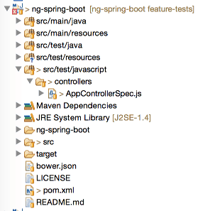

A while ago I wrote my very first Spring Boot application and I showed you how fast it could be using Spring Boot and AngularJS. I also thought about testing all sides of the application, so I started with writing some integration tests for my REST API, then I wrote some unit tests using Mockito and JUnit, and now it's time to write some unit tests for my JavaScript code.

### Setting up the tests

One of the most popular testing frameworks for JavaScript is [Jasmine](http://jasmine.github.io/). It has been integrated in a lot of testing platforms like Karma, but there is also a Maven plugin for running Jasmine tests as well. I'm not going into too much detail, but if you're interested in how to use Jasmine together with AngularJS, I recommend you to read one of [my earlier tutorials](/jasminify-angular-app/ "Jasminify your Angular app") about testing your AngularJS application with Jasmine.

The setup is quite similar in this example, except that we're in a Java-project. First of all, create a folder called **src/test/javascript**. This will be the root folder of all our specs. Inside this folder, create a folder called **controllers** with our testfile inside, called **AppControllerSpec.js**.



To write a Jasmine test, you first start with declaring what you're going to test, for example:

```javascript
describe('The application controller', function() {
  // ...
});
```

Then we can start creating some variables containing our controller scope, mocks and test data:

```javascript
var $scope, factory, saveCallback, queryCallback;
  
var ITEM1 = {
  id: 1,
  description: 'My first item',
  checked: false,
  $remove: function(callback) {
    callback();
  }
}, ITEM2 = {
  id: 2,
  description: 'My second item',
  checked: true,
  $remove: function(callback) {
    callback();
  }
}, DESCRIPTION = "A description";
```

The final preparation before writing tests is to setup AngularJS using the mocking framework of AngularJS:

```javascript
beforeEach(module('myApp.controllers'));
beforeEach(inject(function($controller, $rootScope) {
  factory = function() { };
  factory.prototype.$save = function(cb) {
    saveCallback = cb;
  };
  factory.query = function(cb) {
    queryCallback = cb;
  };
    
  $scope = $rootScope.$new();
  $controller('AppController', {
    '$scope': $scope,
    'Item': factory
  });
}));
```

This will set up our resource factory as a mock, and inject it inside the controller.

### Writing some Jasmine tests

Now we have injected a mock inside the controller, and we prepared everything so we can test the controller using the `$scope` variable.

An example test would be:

```javascript
it('should clear the textfield when adding a new item', function() {
  // When the new description is entered inside the textbox
  $scope.newItem = DESCRIPTION;
  $scope.addItem(DESCRIPTION);
    
  expect($scope.newItem).toBe("");
});
```

What happens here is that we verify that if we add an item to the list, we can clear the model used for filling the textfield.

The other tests are quite similar, sometimes we have to mock some action (for example querying the resource should return items), but it's not too hard:

```javascript
it('should have correct items', function() {
  // When item1 and item2 are returned from service
  queryCallback([ITEM1, ITEM2]);
    
  expect($scope.items).toContain(ITEM1);
  expect($scope.items).toContain(ITEM2);
  expect($scope.items.length).toBe(2);
});

it('should save the item when adding a new item', function() {
  // When saving an item returns the persisted result
  $scope.items = [];
  $scope.addItem(DESCRIPTION);
  saveCallback(ITEM1);
    
  expect($scope.items).toContain(ITEM1);
  expect($scope.items.length).toBe(1);
});
  
it('should remove the item from the list when it's deleted', function() {
  // When there are two items and ITEM1 is removed
  $scope.items = [ITEM1, ITEM2];
  $scope.deleteItem(ITEM1);
    
  expect($scope.items.length).toBe(1);
  expect($scope.items).toContain(ITEM2);
  expect($scope.items).not.toContain(ITEM1);
});
```

We can also use Jasmine to verify that specific methods have been called on a mock, for example:

```javascript
it('should update the item when changing it', function() {
  // When an item is changed
  var changedItem = jasmine.createSpyObj('Item', ['$update']);
  $scope.updateItem(changedItem);
    
  expect(changedItem.$update).toHaveBeenCalled();
});
```

So, first we setup the item to have a `$update()` function, which is made available as a spy by Jasmine. Later on, we can verify if that function has been called by using the `toHaveBeenCalled()` function.

### Configuring Maven

To configure Maven, we will be using two additional plugins, first of all we need a plugin to run our Jasmine tests. However, Jasmine requires you to run your tests on a platform supporting JavaScript. This could either be your web browser, or a platform like PhantomJS. I'm going for the second option, but that means we also have to setup PhantomJS, and that's why I'm going to need another plugin.

But before we start, I'm also going to add some additional properties for enabling/disabling the Jasmine tests (and PhantomJS), so that we don't have to run them each time. The other property will be useful for the Jasmine configuration. We will often have to refer to our libraries, so it's a lot easier if we can store the path to the libraries (Bower components folder) into a property:

```xml
<js-tests.skip>false</js-tests.skip>
<bower-components>${basedir}/src/main/resources/static/bower_components</bower-components>
```

Now the configuration of the PhantomJS plugin:

```xml
<plugin>
  <groupId>com.github.klieber</groupId>
  <artifactId>phantomjs-maven-plugin</artifactId>
  <version>0.4</version>
  <executions>
    <execution>
      <goals>
        <goal>install</goal>
      </goals>
    </execution>
  </executions>
  <configuration>
    <version>1.9.8</version>
    <skip>${js-tests.skip}</skip>
  </configuration>
</plugin>
```

The setup is quite simple, just look at the examples at the [plugin website](http://kylelieber.com/phantomjs-maven-plugin/).

Now, the next plugin is the [Jasmine plugin](http://searls.github.io/jasmine-maven-plugin/). The configuration of this plugin is a bit more complex, because we have to configure all sources, PhantomJS and testing files:

```xml
<plugin>
  <groupId>com.github.searls</groupId>
  <artifactId>jasmine-maven-plugin</artifactId>
  <version>1.3.1.5</version>
  <executions>
    <execution>
      <goals>
        <goal>test</goal>
      </goals>
    </execution>
  </executions>
  <configuration>
    <skipJasmineTests>${js-tests.skip}</skipJasmineTests>
    <webDriverClassName>org.openqa.selenium.phantomjs.PhantomJSDriver</webDriverClassName>
    <webDriverCapabilities>
      <capability>
        <name>phantomjs.binary.path</name>
        <value>${phantomjs.binary}</value>
      </capability>
    </webDriverCapabilities>
    <jsSrcDir>${basedir}/src/main/resources/static/app</jsSrcDir>
    <jsTestSrcDir>${basedir}/src/test/javascript</jsTestSrcDir>
    <preloadSources>
      <source>${bower-components}/angular/angular.js</source>
      <source>${bower-components}/angular-resource/angular-resource.js</source>
      <source>${bower-components}/angular-mocks/angular-mocks.js</source>
      <source>${basedir}/src/main/resources/static/app/app.js</source>
    </preloadSources>
  </configuration>
</plugin>
```

So, as you can see, the configuration of this plugin is a bit more complex. First of all we tell it which webdriver we're going to use (which will be PhantomJS). The PhantomJS plugin will set a property called `${phantomjs.binary}`, so we can reference it in this plugin. Then we tell it where our source files and test source files are and finally we also have to tell it where our additional source files are. These are mainly our libraries and test-libraries, but we will also add **app.js** to this list, so that the application itself is always bootstrapped for our tests.

### Testing it out

Testing it out is quite simple, the next time you build using Maven, you will see that the Jasmine tests will be executed as well. So, when executing the following command:

```
mvn clean install
```

You should see something like this:


You can also run the Jasmine test runner, by using the following command:

```
mvn jasmine:bdd
```

After executing the command, you can go to [http://localhost:8234](http://localhost:8234) which will launc the Jasmine Spec Runner.


#### Achievement: Wrote Jasmine tests and used Maven to execute them

Seeing this means you read this short tutorial about unit testing your JavaScript code in a Java/Maven environment. If you're interested in the full code example, you can find it on [GitHub](https://github.com/g00glen00b/ng-spring-boot/tree/feature-tests). If you want to try out the code yourself, you can download an archive from [GitHub](https://github.com/g00glen00b/ng-spring-boot/archive/feature-tests.zip).
