If you're just like me and you're over 20 years, you might have spent several years on IRC and you probably interacted with hundreds of bots over the years. You may have written your own bot, just like I did. Well, with todays frameworks, API's and tools it's a lot easier to write such a bot... in the cloud.

### Slack

Let's start with an introduction first. In this tutorial I'm not going to write an IRC bot, but a Slack bot. [Slack](https://slack.com/) is a platform for team communication. It's an alternative to one of the many team communication platforms like Hipchat, Flowdock, Campfire, ... .

The great part of Slack is that it has many possible ways of integrating existing tools in Slack, this is just a small part of the big list of integrations:

[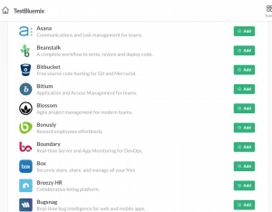](https://wordpress.g00glen00b.be/wp-content/uploads/2015/05/slack-integrations.png)

### Watson

[IBM Watson](http://www.ibm.com/smarterplanet/us/en/ibmwatson/) is a cognitive system that allows a whole new level of "communication" between people and computers. If you ever watched Jeopardy on television, chances are you may have already seen IBM Watson as he competed with two of the biggest players of the game and won. When you're using Bluemix you actually have access to certain API's of that supercomputer.

### Node-RED

[Node-RED](http://nodered.org/) is a tool for wiring together hardware devices, APIs and online services in new and interesting ways. It is written in JavaScript on Node.js entirely, made by IBM and provided it to the open source community.

The way Node-RED works is that you can put together entire flows by just adding some nodes and connecting the dots. You can make REST calls, read/store data in a database, you can communicate with other services, ... .

The screenshot below is an example of how my Slack bot eventually looks like.

[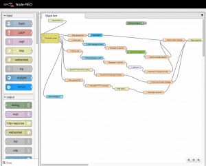](https://wordpress.g00glen00b.be/wp-content/uploads/2015/05/node-red.png)

### Bluemix

The last five to ten years the cloud was one of the trending topics in the world of IT. IBM is very well aware of that and invested quite a lot in creating their own PaaS (Platform as a Service) and created [Bluemix](https://bluemix.net/). Nearly a year ago (30 june 2014) Bluemix went public with their first release. So in a month Bluemix will have its first anniversary.

[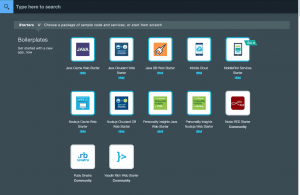](https://wordpress.g00glen00b.be/wp-content/uploads/2015/05/bluemix-catalog.png)

### Setting up your Node-RED application

So, after registering for Slack and Bluemix (you can get a free trial for 30 days), it's time to create your first application. Explore the catalog a bit and what we're going to use is the **Node-RED starter**. So use the boilerplate, which will create a Node.js application with Node-RED on and it will add two services:

- A [Cloudant](https://cloudant.com/) database
- A tool for analytics and monitoring

[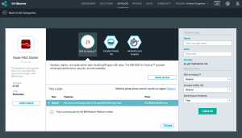](https://wordpress.g00glen00b.be/wp-content/uploads/2015/05/bluemix-create.png)

In this example I'm not going to use that tool, so after creating the application I chose to unbind/delete the service and I added two other services in stead:

- Watson: Personality insights
- Watson: Question and Answer

[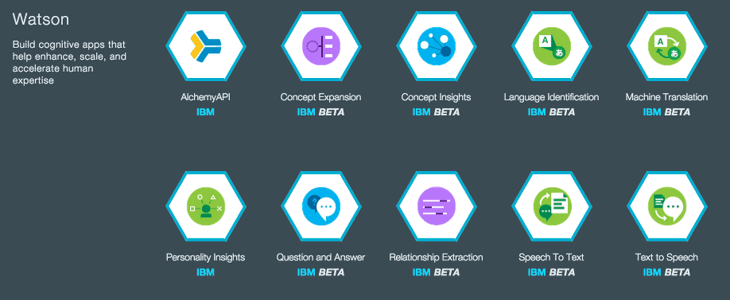](https://wordpress.g00glen00b.be/wp-content/uploads/2015/05/bluemix-watson.png)

Make sure you connect both of them to your application.

After staging the application you can visit the provided URL and you will get an empty/white Node-RED dashboard to play with. Let's start by creating your first node, a **HTTP **node. Double click on the node to get the configuration wizard of that node, in this case you should add something like:

[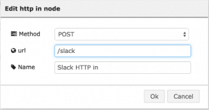](https://wordpress.g00glen00b.be/wp-content/uploads/2015/05/http-node.png)

Remember the URL, because we're going to use that URL to configure the outgoing webhook.

### Slack

In Slack I'm going to create two integrations:

- Incoming webhooks
- Outgoing webhooks

For the configuration of the outgoing webhook you're going to choose to use a channel (I'm going to use **#general**) and you will have to set the URL to the URL of the Node-RED HTTP node, which is **<application URL>/slack**.

Fo the incoming webhook you will have to configure the channel as well (**#general**) and you'll have to copy the Webhook URL.

### Creating your bot

Now let's get back to Node-RED. Create a **HTTP request** node and double click on it. This will communicate with the incoming webhook of Slack, so paste the URL you copied earlier and set the method to POST.

[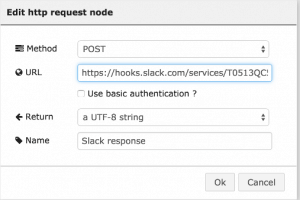](https://wordpress.g00glen00b.be/wp-content/uploads/2015/05/http-request.png)

Let's start of with a simple bot that allows you to throw a coin. The first node we're going to create is a **switch**. Just like the old IRC bots, we're going to create several commands like !coin, !travel, !personality and !sentiment, to split up our workflow based on those commands, we use a switch.

First of all you have to know that the HTTP node we created earlier, has a `msg.payload` property that contains the JSON response of the Slack webhook. The text that was entered is now available within the property `msg.payload.text`, so we're going to use that to make our various switches.

The first rule will check if any text matches the regular expression `^!coin`. This means that the text should start with !coin and can be followed by anything else.

[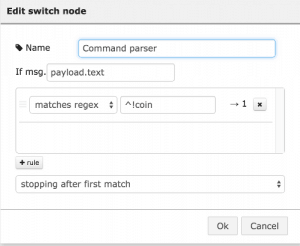](https://wordpress.g00glen00b.be/wp-content/uploads/2015/05/switch-node.png)

The next part is to create a **function** node, with these functions we can write specific logic (in JavaScript) to create a new message payload. In our case we're going to use `Math.random()` to either display Tails or Heads. So double click the node and add the following function:

return {
    payload: Math.random() >= 0.5 ? "Heads" : "Tails"
};

So now we already have the output, now we have to write another function node that converts that output to the output that the Slack webhook needs (read their documentation for more info). So I converted the payload to have a username, an avatar and the text that the bot will display:

var text = {
    text: msg.payload,
    username: "Watson",
    icon\_url: "https://pbs.twimg.com/profile\_images/521373680501149696/YXWVjs82.jpeg"
};
return {
    payload: JSON.stringify(text)
};

The `icon_url` property actually contains the Twitter profile picture of [@IBMWatson](https://twitter.com/ibmwatson). Obviously, this command has nothing to do with Watson, but the next commands will be, so that's why I created this node separately, to reuse it for other flows/commands.

Anyways, those are all the nodes we need, connect the last function to the **HTTP request** node and we're done.

[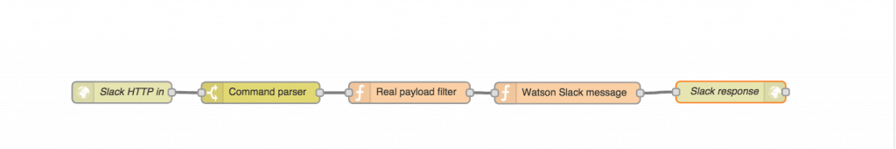](https://wordpress.g00glen00b.be/wp-content/uploads/2015/05/nodered-coin-flow.png)

Press the **Deploy** button on the top right corner of Node-RED, go back to Slack and enter **!coin** in the **#general** channel, which should already be working:

[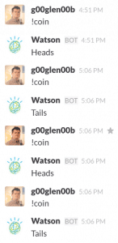](https://wordpress.g00glen00b.be/wp-content/uploads/2015/05/slack-coins.png)

### Adding Watson to the flow

So, after writing our first Node-RED flow, it's time for some more! Open the **switch** node again and add a new rule that matches the regex **^!travel**. It will add a second connector dot on the right side of the switch node. Let's try to make it communicate with the Q&A node by making it possible to enter **!travel <your question>**. We can now distinguish this command from the !coin command, but now we have to strip the command "!travel" from the text itself, so let's add a new **function** node and attach it to the second connector of the switch.

The following function will strip away the travel command itself from the beginning of the string:

var msg = msg.payload.text;
return {
    payload: msg.replace(/^!travel\\s\*/, "")
};

So now our payload is ready to be used by the Watson Q&A service, so let's add a **Watson Q and A** node to the flow. Double click it and configure it to use the travel service (or the healthcare service if you prefer):

[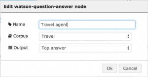](https://wordpress.g00glen00b.be/wp-content/uploads/2015/05/watson-qa-node.png)

This node will output the highest scoring answer as payload, so connect it to the node that converts the payload to a Slack message (with the Watson username + profile picture). If you did that and redeployed the Node-RED flow, you can start by asking Watson some traveling questions:

[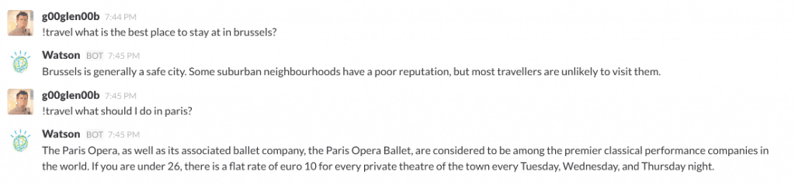](https://wordpress.g00glen00b.be/wp-content/uploads/2015/05/slack-travel.png)

### Analyzing your personality

The last flow I'm going to show you is how you can make Watson analyze your personality. This flow consists out of two parts. First we have to make sure that there is enough data available to analyze. Watson requires at least 100 words input to be able to analyze your personality, but because most messages are a lot shorter, we will have to store all messages inside a database (Cloudant) and then we can put those together and make Watson analyze it.

So, let's open the switch node again and add the following rules:

- Matches regex **^!personality**
- Otherwise

If you're done, there should be two additional connector dots. Now add the **Cloudant** storage node, make sure you take the one with the connector dot on the left side, because that one is for storage, while the other one is for querying.

Now double click the Cloudant node and configure it like this:

[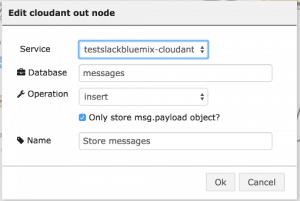](https://wordpress.g00glen00b.be/wp-content/uploads/2015/05/cloudant-node.png)

It is possible that you may have to create the database manually (though if I remember correctly that happens automatically). Anyways, if you want to view the Cloudant database you can go to your Bluemix dashboard and click on the **Cloudant storage** service. This will open a new window with a Launch button on the top right corner.

[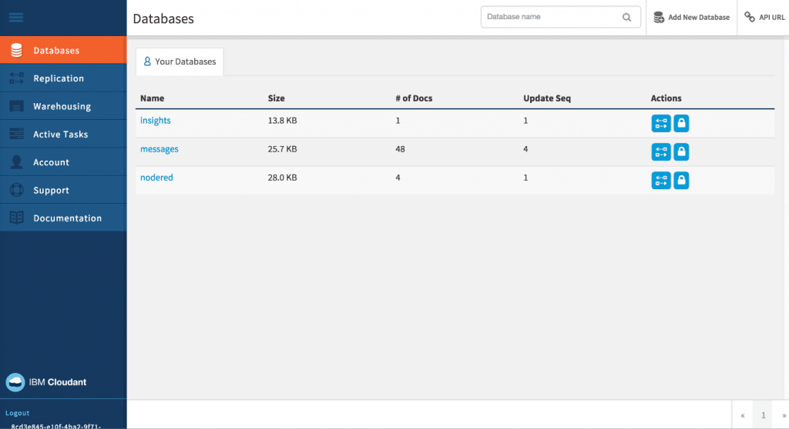](https://wordpress.g00glen00b.be/wp-content/uploads/2015/05/cloudant-dashboard.png)

Now open the Cloudant dashboard by pressing the Launch button and you can view the databases and add new ones as well.

Anyways.. back to Node-RED. Connect the last connector of the switch to the Cloudant storage node. Normally (if you provided the rules in the same order) this flow will be used when the "Otherwise" is activated.

Now, for the other flow that is triggered when we say "!personality", we have to create a function first that creates a query that searches for all messages posted by that user in Cloudant. Quite easy, this is the function:

return {
    payload: "username:" + msg.payload.username
};

Now connect that function to the third dot on the switch and create another **Cloudant** storage node, but this time use the one that has the dot on the left side and the right side. Connect it to the function we just made and double click on it to configure it so it uses the same database as we used for storing the messages.

[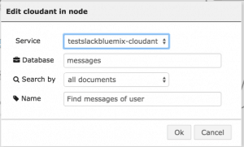](https://wordpress.g00glen00b.be/wp-content/uploads/2015/05/cloudant-query-node.png)

The personality node takes one message, so we will have to create a **function** node that converts all these stored messages to a single string, for example:

var messagesStr = "";
if (msg.payload != null) {
    for (var idx = 0; idx < msg.payload.length; idx++) {
        messagesStr += msg.payload\[idx\].text;
        messagesStr += " ";
    }
}
return {
    payload: messagesStr
};

If you created such a function and connected it to the Cloudant node, then you can create a Watson **Personality insights** node. Connect it to the function we just made and that it, no other configuration is necessary.

This API gives a lot of information as a result, so we'll have to write a function that actually converts it to a simple message that can be posted on Slack. The API returns an entire tree of personality characteristics, values and needs. I chose to write a function that displays all characteristics that score above 50% and group them by their category (personality, values or needs). So let's add another function node and write the following:

function getInsights(insights, min) {
    var data = {
        personality: "",
        needs: "",
        values: ""
    };
    for (var idx = 0; idx < insights.length; idx++) {
         var insight = insights\[idx\];
         if (insight.percentage != null && insight.percentage > min && insight.percentage < 1) {
            data\[insight.category\] += insight.name + ": " + Math.round(insight.percentage \* 100, 0) + "%, ";
        }
        if (insight.children != null) {
            var children = getInsights(insight.children, min);   
            data.personality += children.personality;
            data.needs += children.needs;
            data.values += children.values;
        }
    }
    return data;
}

var data = getInsights(msg.insights.children, 0.5);
var msg = "\*Personality\*:\\r\\n  " +  data.personality.substring(0, data.personality.length - 2);
msg += "\\r\\n\*Needs\*:\\r\\n " + data.needs.substring(0, data.needs.length - 2);
msg += "\\r\\n\*Values\*:\\r\\n " + data.values.substring(0, data.values.length - 2);

return {
    payload: msg
};

It's a bit long, but what it actually does is that it loops recursively over the tree and adds all characteristics that score more than a given threshold (50%) to a single string and formats it later on.

That message is ready to be consumed by the function that converts the payload to the Watson Slack user message we wrote earlier on. So connect it and you're ready to deploy your new flows.

To test your flows you actually have to enter some text first, so make sure you entered at least one hundred words before you call the !personality command.

[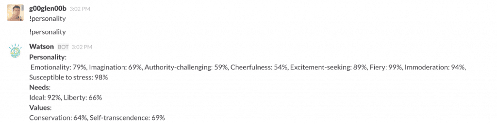](https://wordpress.g00glen00b.be/wp-content/uploads/2015/05/personality-slack.png)

At the first try I forgot to deploy my Node-RED flow, so obviously I didn't get a result. Anyways, we built a pretty cool bot using Slack, IBM Bluemix, Node-RED and IBM Watson.

I even had so much fun (and it's quite easily), so I added some extra API's as well using [Mashape](https://www.mashape.com/dashboard) and the [Internet Chuck Norris Database API](http://www.icndb.com/api/):

It's probably not the most useful usecase of using Node-RED, Slack, IBM Watson and Bluemix, but I think it illustrates the power of their APIs/capabilities well enough.

### Adding Chuck Norris to your bot

For the final flow I would like to show you how I used the Internet Chuck Norris Database API to create a Chuck Norris bot.

First of all, we have to change the switch node a bit, create a new rule that listens for the regular expression **^!chuck** and make sure you drag the rule on top of the otherwise-rule. If you don't do that, the otherwise-rule will have a higher priority, and it will never make it into the "Chuck Norris rule".

After altering the switch node, create a new **HTTP request** node, and make sure the URL points to [http://api.icndb.com/jokes/random](http://api.icndb.com/jokes/random).

[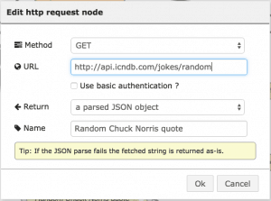](https://wordpress.g00glen00b.be/wp-content/uploads/2015/05/chuck-norris-node.png)

After connecting the switch to the new HTTP request node, create a function node that will extract the random joke from the response, and serve it as payload:

return {
    payload: msg.payload.value.joke
};

The last step is that we have to send a message to the Slack webhook, but we don't want it to be posted as Watson, do we? So create a new **function** node (or duplicate the function we use for posting messages as Watson) and alter it to have "Chuck Norris" as the name and choose an appropriate picture:

var text = {
    text: msg.payload,
    username: "Chuck Norris",
    icon\_url: "http://static-files1.modthesims2.com/customavatars/avatar7265094\_1.gif"
};
return {
    payload: JSON.stringify(text)
};

After doing that, you can connect it to the Slack incoming webhook node and you're ready to test it. Hit the deploy button and enter the **!chuck **command.

And there you have it, your own Chuck Norris bot!

### Conclusion

Node-RED easily allows you to create flows to input/process/output data through various endpoints (REST, Websockets, MQTT, ...), that means it's not limited to writing simple Slack bots, but you can have an entire automatic mail response system set up with Nod-RED or you could have a Node-RED flow that automatically retweets certain tweets, ... .

With Node-RED on Bluemix, you also have direct access to some of the coolest APIs with Watson, you can easily integrate it with existing services (MongoDB, Cloudant, Twilio, ...) and many, many more.

And finally, Slack provides some great APIs to test it out, but remember that Node-RED is not limited to making Slack bots... it was just easier at that time. There are TCP nodes so you could actually make an IRC bot as well (maybe there are dedicated IRC nodes too). Using the webhooks was probably not the best solution (because if you have a very commonly used channel, it will easily overflow the HTTP hook, so it gets disabled), but they also have a realtime API, but that requires to set up a node that uses that realtime API, which isn't available out of the box.

#### Achievement: Created your own smart Slack bot with Node-RED and Watson on Bluemix

If you're seeing this, then it means you successfully managed to make it through this article. If you're interested in creating this bot by yourself, you can try to import this [Node-RED configuration](https://gist.github.com/g00glen00b/bd9277d79df24939b0d4) (you'll have to change some services and URLs).
