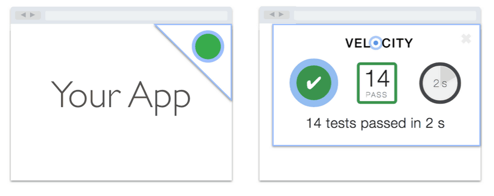
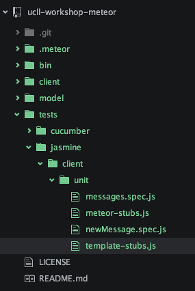
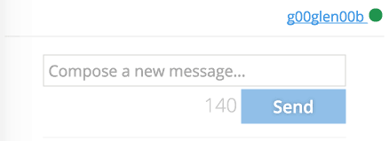
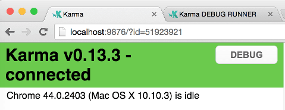
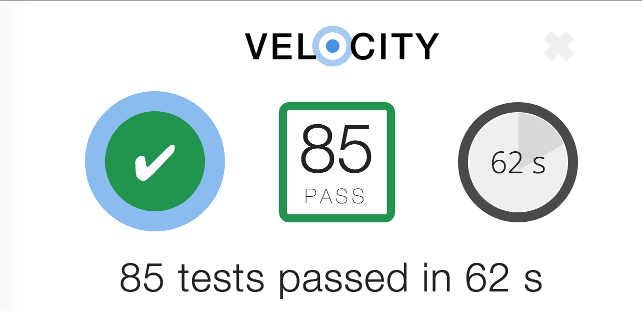
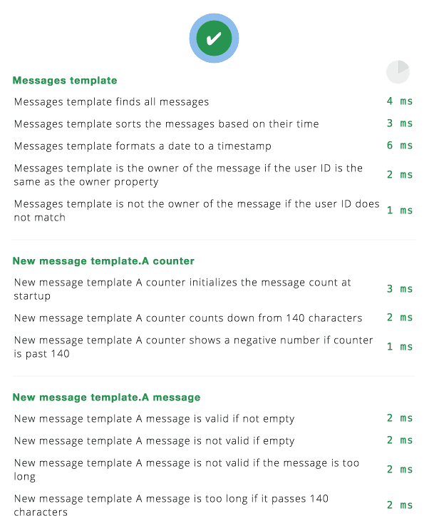

In my [previous tutorial](/writing-a-chat-application-with-meteor/) I explained some of the basic features of Meteor, a full stack JavaScript platform. In this tutorial I will go more in depth about testing a Meteor application, by testing the chat application we wrote in the previous tutorial. In this first part I'll show you how to unit test your Meteor application using the [Velocity platform](https://velocity.readme.io/docs).

### Introduction to Velocity

Velocity is actually a set of tools, and currently supports several frameworks like [Jasmine](http://jasmine.github.io), [CasperJS](http://casperjs.org), [Cucumber](https://cucumber.io), [Mocha](http://mochajs.org), [Dredd](http://dredd.readthedocs.org/en/latest/) & [Robot](http://robotframework.org). So, what is Velocity? Velocity provides a mirror of your application with a separate database that can be used for testing. It also provides the possibility to add fixtures, which are small pieces of code that can be used within the mirrored application to make it easier to test. Velocity also comes with two test runners, a HTML test runner and a console test runner.



### Preparing the project

For our unit tests I'll be using Jasmine and [Sinon.js](http://sinonjs.org/). Jasmine is a BDD testing framework, while Sinon.js is a mocking framework. Velocity also allows you to stub the Meteor API's, but I like to provide my own stubs and spies.

So, after downloading the project of the last tutorial, you'll have to add some packages:

```
meteor add sanjo:jasmine
meteor add practicalmeteor:sinon
meteor add velocity:html-reporter
```

The Meteor Jasmine package expects your tests to be in specific folders, to let's create it as well. Create a folder called `tests/jasmine/client/unit`, there are also folders for serverside unit tests, or integration tests on either side, but I'm not going to use them in this tutorial.

Inside the folder create four files:

- `messages.spec.js`: This will contain our tests of the messages template
- `newMessage.spec.js`: This file will contain the tests of the newMessage template
- `meteor-stubs.js`: In this file I will create stubs of the Meteor API's using Sinon.js
- `template-stubs.js`: In this file I will create stubs specifically for the templates using Sinon.js



### Stubbing with Sinon.js

One "issue" that will pop up when testing Meteor applications is that you don't have direct access to the functions because Meteor wraps all of them inside a function, the most prominent approach to test the functions is by stubbing the templates you're using to add the functions either as helpers or event handlers.

So, since we're only using helpers in the messages template, but helpers and events in the newMessage template, I'll be stubbing the following calls within the **template-stubs.js** file:

```javascript
Template = {
  newMessage: sinon.stub({
    helpers: function() {},
    events: function() {}
  }),

  messages: sinon.stub({
    helpers: function() {}
  })
};
```

Sinon.js makes things really easy for making stubs, you could just use `sinon.stub()` to create a stub function, but if you add an argument containing an object with functions, Sinon.js will create an object with a stub function for every function in that object, in this case the helpers and the events.

Inside the **meteor-stubs.js** file on the other hand, we're going to stub all calls to the Meteor API that I used in the application. There are three functions used, `Meteor.userId()`, `Meteor.user()` and `Meteor.startup()`, so let's stub those:

```javascript
Meteor = sinon.stub({
  startup: function() {},
  user: function() {},
  userId: function() {}
});
```

However, please be aware that Velocity also allows you to stub the Meteor API's, I'm just a big fan of how Sinon.js works and Velocity kinda lacks the documentation to be able to use it properly.

### Testing the messages template

A Jasmine test has a specific syntax that has to be followed, first of all we have to describe what we're going to do, in this case I'm going to start by writing tests for the messages template (**messages.spec.js**), so I'm going to write:

```javascript
describe('Messages template', function() {
  // Put tests here
});
```

Then I'm going to create a small function to help me with easily retrieving a specific helper function of that template:

```javascript
function helper(name) {
  return Template.messages.helpers.firstCall.args[0][name];
}
```

In this function you can see how simply Sinon.js works. On each stub function (for example `Template.messages.helpers`) there are several additional functions and properties available. In this case I would like to get the argument of the first call of that function, so I'm using `firstCall.args`, which will give me an array of all arguments. Since the helpers function only accepts a single parameter (an object with all helpers), I'm going to get the element at the first index. That will give me the object with all helpers.

Also, next to stubbing the template and the Meteor API, I'm also going to stub the Mongo collection (`Messages`). I'm going to do that before each test, luckily Jasmine allows us to do that using `beforeEach()`:

```javascript
beforeEach(function() {
  Messages = sinon.stub({
    find: function() {}
  });
});
```

We're only going to use the `Messages.find()` function inside the messages template, so that's the only thing we'll need to stub.

Finally we can start writing some unit tests.

### Writing unit tests

The first helper I'm going to write tests for is the messages helper. The only thing this helper does is returning all objects in the `Messages` collection, so if we test in our unit test that the `Messages.find()` function has been called, then we're set:

```javascript
it('finds all messages', function() {
  helper('messages')();
  expect(Messages.find.calledOnce).toBeTruthy();
});
```

So, let's break this into parts. First of all we have the declaration of a unit test using Jasmine:

```javascript
it('finds all messages', function() {
  // Test code here
});
```

This represents one unit test. Inside the test we're first going to call the messages helper, using the `helper()` function we created earlier. Then I'm going to use Sinon.js to verify if `Messages.find()`has been called once. The result of this should be true, so with Jasmine we can make an expectation here using the `expect()` function. And that's it, we wrote our first unit test.

Now, in the next test I'm going to verify that the messages are sorted by their date. If you recall, we passed an argument to the `Messages.find()` function to tell it to sort by the time property descending. Well, we can use Sinon.js to verify that the argument of the first call indeed matches this behaviour, so let's do that:

```javascript
it('sorts the messages based on their time', function() {
  helper('messages')();
  expect(Messages.find.getCall(0).args[1].sort.time).toBe(-1);
});
```

Quite similar to what we have done before. If you look at the `helper()` function we created earlier, we also used something similar to retrieve the argument. In this case I'm not using `firstCall.args[]` (which I could), but I'm using `getCall(0).args[]`, which does the same thing, but for demonstration I thought it would be interesting to show some other parts of the Sinon.js API.

The next function I'm going to test is the `time()` function which formats a date into a proper timestamp. This is quite simple to test, we pass the function a date object and check if the string matches our expectations:

```javascript
it('formats a date to a timestamp', function() {
  expect(helper('time')(moment('18:23:45', 'HH:mm:ss').toDate()))
    .toBe('18:23:45');
});
```

I'm using Moment.js here to create my date object, because if I created a date object myself using an ISO timestamp, it would be depending on the timezone you live in, which would make the test fail for specific timezones.

The last helper I need to test is the `isOwner()` function. In this case I'm going to make the `Meteor.userId()` function return something, which is possible because we stubbed that earlier in this tutorial. Then I'm going to make sure that the `owner` property of the mesage I'm going to check contains the same user ID, and if they match, then `isOwner()` should pass us a truthy value, if they don't match, it should be false. I wrote two tests to verify each case:

```javascript
it('is the owner of the message if the user ID is the same as the owner property', function() {
  Meteor.userId.returns('123-456-789');
  expect(helper('isOwner')({
    message: 'Hi',
    date: new Date(),
    owner: '123-456-789'
  })).toBeTruthy();
});

it('is not the owner of the message if the user ID does not match', function() {
  Meteor.userId.returns('123-456-789');
  expect(helper('isOwner')({
    message: 'Hi',
    date: new Date(),
    owner: '456-789-123'
  })).toBeFalsy();
});
```

So, as you can see, we use the `returns()` method on the Sinon.js stub to return a specific user ID and then compare the owner property of a message to it.

### Testing the newMessage template

To test the newMessage template I'm going to write a separate spec file (**newMessage.spec.js**), but we'll start the same as our other test file:

```javascript
describe('New message template', function() {
  function helper(name) {
    return Template.newMessage.helpers.firstCall.args[0][name];
  }

  function invokeEvent(name, args) {
    return Template.newMessage.events.firstCall.args[0][name](args);
  }

  beforeEach(function() {
    Session = sinon.stub({
      get: function() {},
      set: function() {}
    });

    Messages = sinon.stub({
      insert: function() {}
    });

    Meteor.user.returns({ username: 'JohnDoe' });
  });

  // Unit tests
});
```

So, in this case we have two functions, a `helper()` function to retrieve a specific helper, but similar to it, we also have a function to invoke a specific event, called `invokeEvent()`.

Then finally we're going to stub the `Messages` collection again, but we only need to stub the `Messages.insert()` function in this case. Additionally I'm also going to stub the `Session` API.

The reason why I'm not putting these stubs inside a stubs file is because these stubs will only be necessary asynchronously, while the other API calls are always directly called. The difference between the stubs files and the `beforeEach()` code block is that the stubs files are executed before the application code, while the `beforeEach()` blocks are executed after the application code. So we simply cannot stub the Meteor or Template calls in a `beforeEach()` block.

In this test file we're going to test three "blocks" in the template, the counter, the form validation and submitting the message and each block has multiple tests. To group these tests you can nest `describe()` blocks, for example if we take a look at the counter tests:

```javascript
describe('A counter', function() {
  it('initializes the message count at startup', function() {
    Meteor.startup.lastCall.callArg(0);
    expect(Session.set.calledWith('messageCount', 0)).toBeTruthy();
  });

  it('counts down from 140 characters', function() {
    Session.get.returns(10);
    expect(helper('count')()).toBe(130);
  });

  it('shows a negative number if counter is past 140', function() {
    Session.get.returns(150);
    expect(helper('count')()).toBe(-10);
  });
});
```

Except that we have a second `describe()` block there's nothing new in these tests, we're just making sure that the `messageCount` item in `Session` contains the specific data we need.

Quite similar to this are the tests for message validation, since they also use the same counter to check if the message is at least 1 character and not more than 140 characters:

```javascript
describe('A message', function() {
  it('is valid if not empty', function() {
    Session.get.returns(1);
    expect(helper('isValidMessage')()).toBeTruthy();
  });

  it('is not valid if empty', function() {
    Session.get.returns(0);
    expect(helper('isValidMessage')()).toBeFalsy();
  });

  it('is not valid if the message is too long', function() {
    Session.get.returns(141);
    expect(helper('isValidMessage')()).toBeFalsy();
  });

  it('is too long if it passes 140 characters', function() {
    Session.get.returns(141);
    expect(helper('isMessageTooLong')()).toBeTruthy();
  });

  it('is not too long if it is less than 140 characters', function() {
    Session.get.returns(139);
    expect(helper('isMessageTooLong')()).toBeFalsy();
  });
});
```

The next tests are about submitting the message itself. In this case we're going to mock an event ourself and I'm going to do that before each test. Just like the `beforeEach()` block we used earlier, you can also use `beforeEach()` in a nested `describe()` block:

```javascript
describe('Creating a new message', function() {
  var myForm;
  beforeEach(function() {
    myForm = { message: { value: 'My message' } };
  });
});
```

Ok, that looks good, so now we can start writing some tests. the first test I'm going to write will check if the message form field is cleared after submitting the message:

```javascript
it('resets the value of the message', function() {
  invokeEvent('submit form', { target: myForm });
  expect(myForm.message.value).toBe('');
});
```

First we invoke the form submit event with our form object we created earlier on and then we check if the message value has been cleared afterwards.

To prevent the default event of the submit event I made the event handler return false. To test that, we can write quite a simple test:

```javascript
it('prevents the default event', function() {
  expect(invokeEvent('submit form', { target: myForm }))
    .toBeFalsy();
});
```

Then we only need to test that each property of the message that is being inserted into the collection has the right data. We have four properties, the message, time, user ID and the username, so I'm going to write four tests for this:

```javascript
it('inserts a new message', function() {
  invokeEvent('submit form', { target: myForm });
  expect(Messages.insert.calledOnce).toBeTruthy();
  expect(Messages.insert.firstCall.args[0].message)
    .toEqual('My message');
});

it('saves the user ID with the message', function() {
  Meteor.userId.returns('123-456-789');
  invokeEvent('submit form', { target: myForm });
  expect(Messages.insert.firstCall.args[0].owner)
    .toEqual('123-456-789');
});

it('saves the username with the message', function() {
  Meteor.user.returns({ username: 'JohnDoe' });
  invokeEvent('submit form', { target: myForm });
  expect(Messages.insert.firstCall.args[0].username)
    .toEqual('JohnDoe');
});

it('saves the current date with the message', function() {
  invokeEvent('submit form', { target: myForm });
  expect(moment(Messages.insert.firstCall.args[0].time)
      .isSame(new Date(), 'day'))
    .toBeTruthy();
});
```

Then we only need one more test to check whether or not the counter is increased with each keyup event:

```javascript
it('sets the message count to the form value length', function() {
  invokeEvent('keyup input[name=message]', { target: { value: 'My message' }});
  expect(Session.set.calledWith('messageCount', 10)).toBeTruthy();
});
```

### Running our tests

By now I think we've written enough tests for this tutorial, so let's check them out. Run your application like usual with the `meteor` command, and when you look at the application, you'll see a green circle at the top right corner of the application (or a red one if something failed).



You may also notice that an additional browser window pops up. The Jasmine package for Velocity uses the [Karma test runner](http://karma-runner.github.io/0.13/index.html) behind the screens and currently the default browser is still Google Chrome, but it can be changed to another browser (or PhantomJS).



Anyways, if you click on the green circle at the top right corner, you'll see that a sidebar pops up showing you the status of the tests. In my case I have 85 passed tests over 62 seconds, but this is mainly because I'm also running some E2E tests, which I'll explain in the next tutorial.



If you scroll down a bit you'll see a more detailed overview of the tests that were executed and their status.



So, if you would change the code now, for example change the `return` statement in the `createMessage()` function to `true`, then you'll see that the Velocity HTML reporter nicely reports it to us.


Sometimes you may have to refresh the Karma debugger to make it appear in the Velocity HTML reporter. Still, if you scroll down and look at the failed tests at the Velocity HTML reporter you see clearly which test failed. The title matches the titles used within the `describe()` blocks, while the name of the test (mentioned in the `it()` statement) is also displayed and the stack + expected value:


The responsible developer may have made a mistake in his code, but these tests clearly show what failed and why it did, so always be clear in naming your tests. In my case, it expected a falsy value for preventing the default event, so now the developer knows, he changes his code and the test becomes green again.

This is the end of the first part of testing Meteor applications with Velocity. My personal opinion about Velocity is that the idea is quite great, integrating various testing frameworks for testing Meteor applications, however the biggest issue right now is that the documentation is somewhat too basic which makes it hard to set up your tests sometimes, but I hope this tutorial may help with solving that problem.

In the next tutorial I'm going to write some E2E tests using Chimp.js, which is a combination of Cucumber, WebdriverIO and Selenium. Stay tuned!

#### Achievement: Unit tested Meteor applications with Velocity, Jasmine and Sinon.js

If you're seeing this, then it means you successfully managed to make it through this article. If you're interested in the full code example, you can find it on [GitHub](https://github.com/g00glen00b/ucll-workshop-meteor). If you want to try out the code yourself, you can download an archive from [GitHub](https://github.com/g00glen00b/ucll-workshop-meteor/archive/master.zip).
