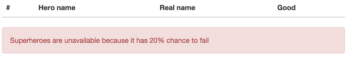

In [my previous tutorial](/spring-data-jpa/) I wrote a small Spring boot application that retrieved data from a database and showed it on a webpage. However, we only handled the happy path, usually stuff may go wrong when retrieving data or doing certain operations.

### Project setup

For this project I'm going to be using the same dependencies as my previous tutorial. Which means you could go to start.spring.io and you add the following dependencies:

- **JPA**: Dependency to use Spring Data JPA
- **MySQL**: MySQL JDBC driver for connecting to a database (you could choose another driver as well if you know what you're doing!)
- **Web**: Dependency for creating web applications
- **Thymeleaf**: Template engine

Once you've done that you can import the project in your IDE. For the database setup I'm also gonna use the same example as in my previous example. I installed a MySQL database and executed the following script:

```sql
CREATE DATABASE demo;

USE demo;

CREATE TABLE IF NOT EXISTS `superhero` (
  `id` INT(11) NOT NULL AUTO_INCREMENT,
  `name` VARCHAR(32) NOT NULL,
  `first_name` VARCHAR(32),
  `last_name` VARCHAR(32),
  `good` bit(1),
  PRIMARY KEY (`id`)
) ENGINE=InnoDB  DEFAULT CHARSET=latin1;

INSERT INTO `superhero` (`name`, `first_name`, `last_name`, `good`) VALUES
  ('Superman', 'Clark', 'Kent', 1),
  ('Silver Banshee', 'Siobhan', 'McDougal', 0);
```

After that I also changed the properties of the Spring boot application (**application.properties**) to contain the credentials to connect to the database:

```
spring.datasource.url=jdbc:mysql://localhost:3306/demo
spring.datasource.username=root
spring.datasource.password=123456
spring.jpa.database-platform=org.hibernate.dialect.MySQLDialect
```

Using YAML (**application.yml**) that would be:

```yaml
spring:
  datasource:
    url: jdbc:mysql://localhost:3306/demo
    username: root
    password: 123456
  jpa:
    database-platform: org.hibernate.dialect.MySQLDialect
```

### Creating an entity

I'm using the same data as in my previous tutorial, so the entity is just the same:

```java
@Entity
@Table(name = "superhero")
public class Superhero {
    @Id
    @GeneratedValue(strategy = GenerationType.AUTO)
    @Column(name = "id")
    private Long id;
    @Column(name = "first_name")
    private String firstName;
    @Column(name = "last_name")
    private String lastName;
    @Column(name = "name")
    private String name;
    @Column(name = "good")
    private boolean good;

    public Long getId() {
        return id;
    }

    public String getFirstName() {
        return firstName;
    }
    public void setFirstName(String firstName) {
        this.firstName = firstName;
    }

    public String getLastName() {
        return lastName;
    }
    public void setLastName(String lastName) {
        this.lastName = lastName;
    }

    public String getName() {
        return name;
    }
    public void setName(String name) {
        this.name = name;
    }

    public boolean isGood() {
        return good;
    }
    public void setGood(boolean good) {
        this.good = good;
    }
}
```

The repository is also, still the same:

```java
public interface SuperheroRepository extends JpaRepository<Superhero , Long> {
}
```

If you want a more detailed explanation about what this all does, I really recommend you to read my previous tutorial. ^^

### Creating a service

In my other tutorials I directly used the repository within my controller, or I directly used mock data in my controller. Normally you would wrap that in a service, because a controller is not exactly responsible for handling all that.

But before we start with an implementation, let's create an interface describing the service:

```java
public interface SuperheroService {
    List<Superhero> findAll();
}
```

In this example I'm only have to create a method to retrieve all superheroes. The implementation of that service would look like this:

```java
@Service
public class SuperheroServiceImpl implements SuperheroService {
    @Autowired
    private SuperheroRepository repository;

    @Override
    public List<Superhero> findAll() {
        return repository.findAll();
    }
}
```

### Controller

Finally we can start writing our controller and wrapping things up:

```java
@Controller
@RequestMapping("/superhero")
public class SuperheroController {
    @Autowired
    private SuperheroService service;

    @RequestMapping
    public ModelAndView getSuperheroes() {
        return new ModelAndView("superheroes", "superheroes", service.findAll());
    }
}
```

The view will look like this:

```html
<!DOCTYPE html>
<html lang="en">
<head>
  <link rel="stylesheet" href="https://maxcdn.bootstrapcdn.com/bootstrap/3.3.5/css/bootstrap.min.css" />
</head>
<body>
<div class="container">
  <table class="table">
    <thead>
    <tr>
      <th>#</th>
      <th>Hero name</th>
      <th>Real name</th>
      <th>Good</th>
    </tr>
    </thead>
    <tbody>
    <tr th:each="hero, status : ${superheroes}">
      <td th:text="${status.count}">1</td>
      <td th:text="${hero.name}">Hero name</td>
      <td th:text="${hero.firstName + ' ' + hero.lastName}">Real name</td>
      <td>
        <span class="glyphicon glyphicon-ok" th:if="${hero.good}"></span>
        <span class="glyphicon glyphicon-remove" th:unless="${hero.good}"></span>
      </td>
    </tr>
    </tbody>
  </table>
</div>
</body>
</html>
```

With this, we created an exact replica of the code in our previous tutorial. The only exception is that we now have a service in between the controller and the repository. But what about the error handling you were talking about at the start of the article?

### Introducing the non-happy path

Now, the reason I wrote a service is because it allows me to create additional behaviour that may lead to errors. For some whacky reason I'm going to add a 20% chance that the `findAll()` method will fail and throw an exception. Why? Because I like breaking things!

In stead of the really simple `findAll()` method in our service, I'm going to replace it by this:

```java
@Override
public List<Superhero> findAll() {
    if (Math.random() < 0.8) {
        return repository.findAll();
    } else {
        throw new SuperheroesUnavailableException("Superheroes are unavailable because it has 20% chance to fail");
    }
}
```

Obviously, you will never write such a thing, and even if you do you should probably be using a random + seed to improve testability. Anyways, for simplicity of being able to test the non-happy paths, I wrote this code.

Obviously you will also need to create your own `SuperheroesUnavailableException` class, mine looks like this:

```java
public class SuperheroesUnavailableException extends RuntimeException {
    public SuperheroesUnavailableException(String message) {
        super(message);
    }
}
```

Now, if we run the application and press refresh a few times (the lucky people might encounter it without refreshing), you'll see a weird page titled **Whitelabel Error Page**.


### Exception handlers

While Spring Boot already provides default exception handlers, we probably want our own. To do that, we open the `SuperheroController` and add the following method:

```java
@ExceptionHandler({SuperheroesUnavailableException.class})
public ModelAndView getSuperheroesUnavailable(SuperheroesUnavailableException ex) {
    return new ModelAndView("superheroes", "error", ex.getMessage());
}
```

So, by providing a method with the `@ExceptionHandler` annotation, we can handle specific kind of exceptions. In this case we only want to handle the `SuperheroesUnavailableException` we just made. To handle the error, I'm going to be using the same view as the original one, but in stead of using the `"superheroes"` model, I'm going to use the `"error"` model and add the exception message.

The last step is to alter the view (**superheroes.html**), to add the following piece of HTML below the `<table>`:

```html
<p class="alert alert-danger" th:if="${error != null}" th:text="${error}"></p>
```

This will show an error message when the error model is not null. So, 80% of the time the message will not be visible. If the error occurs on the other hand, the message will be visible.

### Testing it out

To test it out, you'll have to run the application again and refresh several times until you get the error message popping up.



#### Achievement: Wrote error-prone applications with Spring

If you’re seeing this, then it means you successfully managed to make it through this article. If you’re interested in the full code example, you can find it on [GitHub](https://github.com/g00glen00b/spring-samples/tree/master/spring-boot-jpa-error-webapp).
