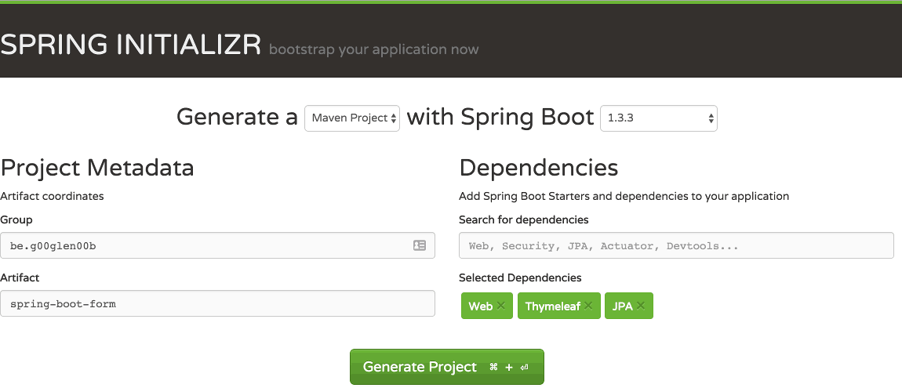
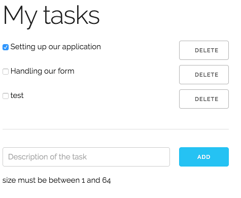
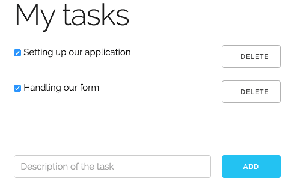

Up until now I've written several tutorials already about creating some readonly Spring boot application, but what's cool about that? Eventually you'll have to add/update some data in your application. In this example I'll show you how you can do that with Spring Web and JSR-303 bean validations.

### Project setup

As I've told a few times already. The greatest place to start any Spring project is [start.spring.io](http://start.spring.io/). In this case I'm going to create a project with four dependencies: Web, HSQLDB, JPA and Thymeleaf.



After creating, downloading, extracting and importing the project in your IDE, you're ready to start writing some code!

### Data model

In this case I'm going to create a simple CRUD application and it seems that 99% of all simple CRUD applications are about todo lists, so let's follow that trend as well.

First of all we need an entity:

```java
@Entity
@Table(name = "task")
public class Task {
    @Id
    @GeneratedValue(strategy = GenerationType.IDENTITY)
    @Column(name = "id")
    private Long id;
    @Column(name = "description")
    private String description;
    @Column(name = "completed")
    private boolean completed;

    public Long getId() {
        return id;
    }

    public String getDescription() {
        return description;
    }
    public void setDescription(String description) {
        this.description = description;
    }

    public boolean isCompleted() {
        return completed;
    }
    public void setCompleted(boolean completed) {
        this.completed = completed;
    }
}
```

We have three properties here, an auto-generated ID, the task description and a boolean indicating if the task is completed or not.

So, let's create our table schema now:

```sql
CREATE TABLE task (
  id          INTEGER IDENTITY PRIMARY KEY,
  description VARCHAR(64) NOT NULL,
  completed   BIT NOT NULL);
```

If you save this file as **schema.sql** in **src/main/resources**, it gets automatically executed when you launch the application, convenient, isn't it?

You could also create the schema by creating one using Hibernate, but in any real-life scenario you probably won't start code-first. Besides, generating your schema based on your entities won't unveil issues with your JPA mappings.

Anyhow, if you create a schema this way, you'll have to disable Spring's default behaviour, which is generating a schema based on your entities if you're using HSQLDB. So, open **application.yml** (or **application.properties**) and add the following:

```yaml
spring:
  jpa:
    hibernate:
      ddl-auto: none
```

Now all we need is some test-data:

```sql
INSERT INTO task (description, completed) VALUES
  ('Setting up our application', 1),
  ('Handling our form', 0);
```

Similarly to our schema, if you save this file as **data.sql** inside the **src/main/resources** folder, it will automatically executed when you start your application.

The last step is to create a repository to handle our data. Create an interface called `TaskRepository` and make it extend from `JpaRepository`:

```java
public interface TaskRepository extends JpaRepository<Task , Long> {
}
```

### Creating a service

Writing a service isn't really that difficult either:

```java
@Service
public class TaskServiceImpl {
    @Autowired
    private TaskRepository repository;

    public List<Task> findAll() {
        return repository.findAll();
    }

    @Transactional
    public Task create(Task task) {
        Task newTask = new Task();
        newTask.setDescription(task.getDescription());
        newTask.setCompleted(task.isCompleted());
        return repository.saveAndFlush(newTask);
    }

    @Transactional
    public Task update(Long id, Task task) {
        Task entity = findOneSafe(id);
        entity.setDescription(task.getDescription());
        entity.setCompleted(task.isCompleted());
        return entity;
    }

    @Transactional
    public void delete(Long id) {
        Task task = findOneSafe(id);
        repository.delete(task);
    }

    private Task findOneSafe(Long id) {
        Task task = repository.findOne(id);
        if (task == null) {
            throw new TaskNotFoundException();
        } else {
            return task;
        }
    }
}
```

The `findAll()` method is quite simple, this method simply uses the repository. In real cases there might also happen some mapping here to make sure you don't expose your entities to the outer world.

The `create()` method creates a new `Task` and saves it using the repository's `saveAndFlush()` method. The reason I'm creating a new task and I'm not using the input is because this allows you to have more control. Some properties do not have to be inserted, like the ID for example. Actually, when you're using a separate model, you can use this to convert your model to your entity.

The same happens for the `update()` method. I'm retrieving the entity using the `findOne()` method and then I'm copying the properties over, one by one. When I can't find an entity with the given ID I'm throwing an exception called `TaskNotFoundException`:

```java
public class TaskNotFoundException extends RuntimeException {
}
```

This allows you to show proper error messages in case someone tries to update a non-existing entity, though that should not happen if using the application.

Finally, the `delete()` method also uses the same `findOne()` method to delete the entity using the `delete()` method of the repository.

### Showing the tasks

The first step in the application is to show the tasks themself. To do that, create a controller called `TaskController` and make it extend from `WebMvcConfigurerAdapter` like this:

```java
@Controller
@RequestMapping("/")
public class TaskController extends WebMvcConfigurerAdapter {
    @Autowired
    private TaskServiceImpl service;

    @RequestMapping(method = RequestMethod.GET)
    public String findAll(Model model) {
        model.addAttribute("tasks", service.findAll());
        return "tasks";
    }
}
```

This uses the service to add the tasks to the model. Then create an HTML file called **tasks.html** inside the **src/main/resources/templates** folder.

```html
<!DOCTYPE html>
<html lang="en" xmlns="http://www.w3.org/1999/xhtml" xmlns:th="http://www.thymeleaf.org">
<head>
  <link rel="stylesheet" href="//fonts.googleapis.com/css?family=Raleway:400,300,600" />
  <link rel="stylesheet" href="//cdnjs.cloudflare.com/ajax/libs/normalize/4.0.0/normalize.min.css" />
  <link rel="stylesheet" href="//cdnjs.cloudflare.com/ajax/libs/skeleton/2.0.4/skeleton.min.css" />
  <title>Task application</title>
</head>
<body>
  <div class="container">
    <h1>My tasks</h1>
    <div class="row" th:each="task : ${tasks}">
      <div class="nine columns">
        <input type="checkbox" name="completed" th:checked="${task.completed}" onchange="form.submit()" />
        <span th:text="${task.description}"></span>
      </div>
      <div class="three columns">
        <button class="button u-full-width" type="submit">Delete</button>
      </div>
    </div>
    <hr />
  </div>
</body>
</html>
```

If you run the application now, you'll see that the dummy tasks we created are already visible.


### Adding new tasks

The next thing we'll do is adding new tasks. To do that, first you have to provide a separate model in the `findAll()` method in the controller:

```java
@RequestMapping(method = RequestMethod.GET)
public String findAll(Model model) {
    model.addAttribute("tasks", service.findAll());
    model.addAttribute("newTask", new Task());
    return "tasks";
}
```

I also added some validations to the `Task` entity by adding some annotations to the properties:

```java
@Id
@GeneratedValue(strategy = GenerationType.IDENTITY)
@Column(name = "id")
private Long id;
@NotNull
@Size(min = 1, max = 64)
@Column(name = "description")
private String description;
@Column(name = "completed")
private boolean completed;
```

The annotations you're seeing here are the JSR-303 annotations I was speaking of. They allow you to validate the properties on your objects. In this case we added both the `@NotNull` and `@Size` annotations.

And finally, we also have to add a method to the controller to save the new task by calling the service:

```java
@RequestMapping(method = RequestMethod.POST)
public String post(@Valid @ModelAttribute("newTask") Task task, BindingResult bindingResult, Model model) {
    if (bindingResult.hasErrors()) {
        model.addAttribute("newTask", task);
        model.addAttribute("tasks", service.findAll());
        return "tasks";
    } else {
        service.create(task);
        return "redirect:/";
    }
}
```

With the `@Valid` annotation you tell Spring that you want to validate the DTO with these annotations, while the `@ModelAttribute` annotation is used to bind the values from the form (which we'll edit after this) back to the model. The name (`"newTask"`) fits the name of the model which we added to the `findAll()` method on the controller.

The `BindingResult` on the other hands contains more info about the result, like the errors from the validation (using the `hasErrors()` method). We'll use this method to either show the error by returning the same model again, and the erroneous task model. On the other hand, if the model is valid, then we add the task using the service and we redirect back to the `findAll()` method.

So now we only have to add the form on which we will bind the model to. To do that, open **tasks.html** again and add the following below the `<hr />` tag:

```html
<form method="post" th:action="@{/}" th:object="${newTask}">
  <div class="row">
    <div class="nine columns">
      <input type="text" placeholder="Description of the task" class="u-full-width" th:field="*{description}" />
      <span th:if="${#fields.hasErrors('description')}" th:errors="*{description}">Description errors</span>
    </div>
    <div class="three columns">
      <button type="submit" class="button-primary u-full-width">Add</button>
    </div>
  </div>
</form>
```

Important here to see are the Thymeleaf attributes starting with the `th:` like `th:action`, `th:object`, `th:field` and `th:if`. Some of them are quite obvious, like `th:action`, which is just a wrapper for the `action` attribue, telling which location to use to submit the form.

The `th:object` attribute on the other hand allows you to bind the model to a form, in this case `${newTask}`. To bind the values of the form elements, you use the `th:field` attribute. In this case we're binding the **description** property to it.

With the `th:if` on the other hand we can show/hide elements on a specific condition. In this case we use the [`Fields`](http://www.thymeleaf.org/apidocs/thymeleaf-spring3/2.0.11/org/thymeleaf/spring3/expression/Fields.html) class, which is part of the integration of Thymeleaf with the Spring framework and allows you to check if any field contains an error according to the bean validations. With the `th:errors` attribute we can show which error occured, which you can override by setting the `message` property of the JSR-303 annotations (`@NotNull` and `@Size` in this case).

Obviously, in proper web applications you would also validate the form on the client as well, using the `maxlength` and `required` attributes, but that would make it a bit harder to test the bean validation, so I'm not going to do that in this case.

So, let's test it out now by running the application. If you open the application, you'll see that the form is now appended correctly. After entering and submitting a value, you'll see that it properly gets appended to the list, which indicates that the application is behaving correctly, at least when following the "happy path".


Now, when we don't enter a value and press the button, you'll see that a message is displayed below the input field, right where we added the `th:errors` attribute.



### Updating the tasks

The next thing we're going to do is to update the tasks, when we check them so we can complete them. Sadly, while this is all quite obvious with JavaScript frameworks like AngularJS, Ember.js, ..., we're going a bit out of the boundaries of what Spring/Thymeleaf does (at least about the model binding part), so the best way to do this is by creating your own form and using hidden fields for the ID.

```html
<form th:method="put" th:action="@{/}">
  <input type="hidden" name="id" th:value="${task.id}" />
  <input type="hidden" name="description" th:value="${task.description}" />
  <input type="checkbox" name="completed" th:checked="${task.completed}" onchange="form.submit()" />
  <span th:text="${task.description}"></span>
</form>
```

Another form here, with the `th:action` attribute we've already seen. The `th:method` on the other hand is quite new, but this is very similar to the normal `method` attribute, with the exception that it also allows put/delete by proxying them through a POST call. The reason for this is that most browsers do not allow this.

Within the form we have the id/description and completed attributes, where two of them (the ID and the description) are hidden. To make the form submit itself when we change the checkbox, we use a little bit of JavaScript, namely the `onchange="form.submit()"` part, which allows you to submit the form in which the element is in.

The last part we have to do to make the update work is to add a method to the controller:

```java
@RequestMapping(method = RequestMethod.PUT)
public String update(@RequestParam Long id, Task task) {
    service.update(id, task);
    return "redirect:/";
}
```

While there is less "magic" involved here, compared to adding items, Spring does allow some neat things, for example, in stead of binding each property individually (the description and the completed), you can simply add a `Task` parameter to your method and Spring will fill the properties for you, allowing us to just send it to the service and redirect it back to the `findAll()` method.

If you reload the application and check the checkbox next to one of the tasks, you'll see that the page gets reloaded, this means the form successfully got submitted and the task was updating. To guarantee that it works you can simply refresh the page, and you'll see that the checkbox is still checked (or unchecked if you unchecked one of the tasks), meaning that your change successfully got persisted.



### Deleting a task

The final part of this application is deleting the tasks. While this no longer has anything to do with form validation, I like finishing something I started and a full CRUD application seems to be a good point to end this article, so all we need is the delete part now.

To do that we do something similar to the update part, by adding another form with the ID as a hidden field on the form, wrapping it around the delete button:

```html
<form th:method="delete" th:action="@{/}">
  <input type="hidden" name="id" th:value="${task.id}" />
  <button class="button u-full-width" type="submit">Delete</button>
</form>
```

Compared to the update form there's nothing new here, and the method we have to add to the controller is similar as well:

```java
@RequestMapping(method = RequestMethod.DELETE)
public String delete(@RequestParam Long id) {
    service.delete(id);
    return "redirect:/";
}
```

So, if we test it out, you'll see that the page reloads as well and the item should properly be deleted.


### Conclusion

While it's hard to imagine a world without JavaScript these days, this would be a solution if you really would have to, but honestly, this code is quite cumbersome compared to JavaScript libraries and frameworks nowadays. Does this mean that the entire code is obsolete? Certainly not, bean validation with Spring is pretty useful, certainly for validating your REST API's.

#### Achievement: Mastered form handling with Spring

If you’re seeing this, then it means you successfully managed to make it through this article. If you’re interested in the full code example, you can find it on [GitHub](https://github.com/g00glen00b/spring-samples/tree/master/spring-boot-form).
