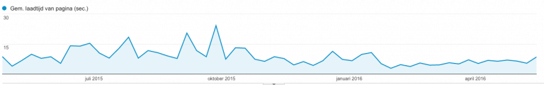
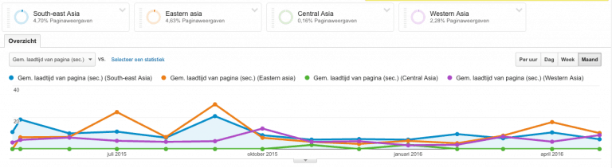
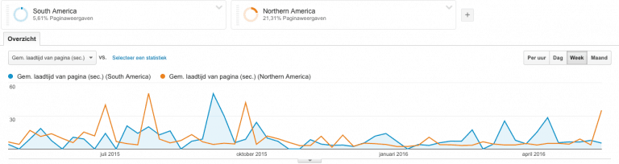
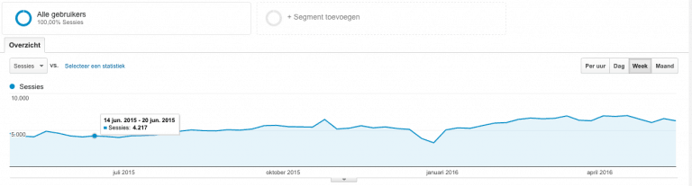
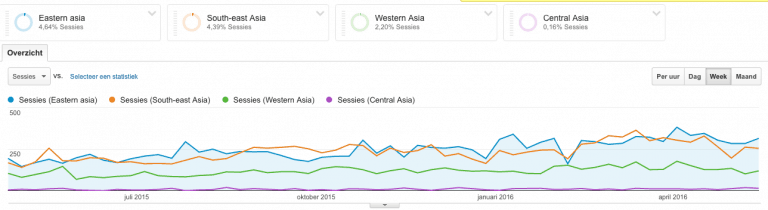
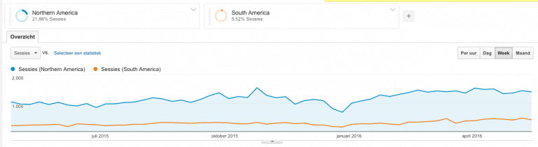

If you're a developer like me and you spent some of your time on Reddit or StackOverflow, you probably might have encountered some articles about CloudFlare last week, like [CloudFlare is ruining the internet (for me)](http://www.slashgeek.net/2016/05/17/cloudflare-is-ruining-the-internet-for-me/) and [CloudFlare is ruining Stack Overflow for me with its recaptcha](https://meta.stackoverflow.com/questions/323537/cloudflare-is-ruining-stack-overflow-for-me-with-its-recaptcha). Reading these articles made me want to evaluate what CloudFlare meant for my website. So let's view the numbers together!

### What is CloudFlare?

CloudFlare is something pretty unique, it is a CDN (or Content Delivery Network), a caching system, security provider, reverse proxy, and an analytics tool combined in one platform. The main reasons I chose CloudFlare for my website were performance and availability. While I had no real issues before using CloudFlare, improving never hurts. Since my webhost is located in Western Europe, it might be more difficult for the other side of the world to reach my website.

I started using CloudFlare for this website about a half year ago (halfway November 2015). So the data from the last few months might already show me some results.

### Site speed

The main reason I was going for CloudFlare was to improve the site speed. So let's take a look at what Google Analytics said about the average site speed globally for the last year:

This first graph (sorry for the dutch labels) already gives us some insights. There is a clear difference in the graph in the period before November 2015 and afterwards. While the loading time didn't go down drastically, it did become a lot more stable. Causing the average loading time to decrease for about 2 seconds globally.

##### Western Europe

Let's see what that means for some subcontinents. The first subcontinent I'm going to view is Western Europe. My initial guess was that there shouldn't be much of a difference since the server itself was already located in this subcontinent.

As you can see, there are some peaks on this graph, I guess that's when the server itself had some issues (got some notifications last year), but if we ignore those, we can see that there isn't much difference in these regions.

##### Asia

Now, the next continent I'm interested in was Asia. The reason why is because the articles I mentioned at the start of this article, also mentioned that there were difficulty in these regions. I added some regions (South-east, Eastern, Central and West Asia) and compared the results.

These results are pretty interesting. I'm not getting a lot of traffic from Central Asia, but for the other ones the result is pretty much similar to what the global result was. The amount of peaks got reduced and there is a 1 to 2 second improvement. Not bad!

##### America

The last continent I want to take a look at is America. Most of my traffic comes from Northern America, so I was pretty interested in what the results were.

Again, similar results here. For Southern America there isn't much improvement, but there isn't much traffic either, so perhaps the dataset isn't large enough? However, for Northern America the results are similar to those of Asia and the global results.

So, if I had to summarize what happened, then I can conclude that CloudFlare is doing a good job at keeping the loading time of my website a lot more stable than before.

### Visitors

In the articles I mentioned before, they're talking about having to enter a recaptcha quite often. It's true, CloudFlare's default setting is medium, but it can be set to **Essentially off** if you're using the free plan. This was one of the few changes I made when adding CloudFlare. I have no idea how many people have to enter a recaptcha token when visiting my website, but it might be worth checking the amount of traffic from all regions to see if it dropped since I added CloudFlare.

If I take a look at the global results, nothing really changed. In fact, the amount of monthly visitors went up by about 1000 over the past year. There is a slight drop around the end of 2015, but that makes sense, since this is the holiday season.

##### Asia

Now, let's take a look at how many visitors I got from Asia.

Well, I'm not seeing a lot of change here either. So I guess not many people are annoyed by entering a recaptcha. There is a drop in february, but by doing some research I realized that this happened around Chinese New year.

As you can see here, I'm not getting much traffic from Central Asia, but I didn't really get much traffic from before adding CloudFlare either.

##### America

Now let's take a look to America as well.

Well, I'm not noticing any change either here. So summarized, the traffic to my website didn't drop by introducing CloudFlare.

### Bandwidth

Since using CloudFlare, I was also able to reduce the amount of bandwidth as well, which could be a good thing if you're having a pay-by-use hosting. If I check my webalizer stats, I can clearly see the difference.

### Conclusion

So, it appears that adding CloudFlare to a website like mine was actually a good idea, even if it might break the internet for some people. I got better availability, my web host has less bandwidth to handle and the cost appears to be minimal.
