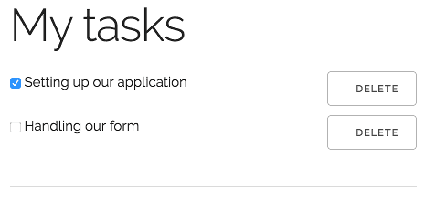
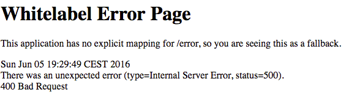

In the [last tutorial](/producing-rest-apis-with-spring/) we created [a small REST API](https://github.com/g00glen00b/spring-samples/tree/master/spring-boot-rest/spring-boot-rest-impl). So now that the "producing REST API" step is completed, it's time to start consuming it in another Spring boot project. Last time we've already set up a module for this project, called **spring-boot-rest-client**.

### Creating a REST client

To create a REST client with Spring, you need to create a [`RestTemplate`](http://docs.spring.io/spring/docs/current/javadoc-api/org/springframework/web/client/RestTemplate.html) instance. This class allows you to easily communicate with a REST API and serialize/deserialize the data to and from JSON.

I created this bean in the `SpringBootRestClientApplication` class (main class), by writing an additional method like this:

```java
@Bean
public RestTemplate restTemplate() {
    return new RestTemplate();
}
```

### Creating a service

The next step is to create a service that uses this RestTemplate bean. I called it `TaskServiceImpl`:

```java
@Service
public class TaskServiceImpl {
    @Autowired
    private RestTemplate restTemplate;
}
```

Now, to consume a REST API we'll have to know where it is located. To configure the location I created a new property in **application.yml** (or **application.properties**) like this:

```yaml
resource:
  tasks: http://localhost:8080/api/tasks
```

To use properties in our classes, you can use the `@Value` annotation. So back in our `TaskServiceImpl` I created two new fields:

```java
@Value("${resource.tasks}")
private String resource;
@Value("${resource.tasks}/{id}")
private String idResource;
```

As you can see, the `${resource.tasks}` placeholder is the same name as we defined in our application properties. The reason I wrote two properties is because we have a path for our collection (finding all tasks + adding a new task) and a path for identifying a single task (updating a task + deleting a task) that requires an ID. For now, we defined the ID as `{id}`.

Now we're going to create a method for each REST endpoint. First of all let's start with the find all operation:

```java
public List<TaskDTO> findAll() {
    return Arrays.stream(restTemplate.getForObject(resource, TaskDTO[].class)).collect(Collectors.toList());
}
```

Quite easy, we used `restTemplate.getForObject()` to retrieve the collection of tasks. Now, because we can't directly map to a `List&lt;TaskDTO&gt;` I mapped it to `TaskDTO[]` and used Java 8 streams to collect it as a list. If you're happy with an array of `TaskDTO` you can use that as well though.

Obviously, we have to define `TaskDTO` in this module as well. If you don't want to do that you can create a shared module between both the consumer and the REST API, but for now I thought that would only make matters more complex. So I copied the `TaskDTO` over:

```java
public class TaskDTO {
    private Long id;
    private String description;
    private boolean completed;

    public TaskDTO() {
    }

    public TaskDTO(Long id, String description, boolean completed) {
        this.id = id;
        this.description = description;
        this.completed = completed;
    }

    public Long getId() {
        return id;
    }

    public String getDescription() {
        return description;
    }
    public void setDescription(String description) {
        this.description = description;
    }

    public boolean isCompleted() {
        return completed;
    }
    public void setCompleted(boolean completed) {
        this.completed = completed;
    }
}
```

Now, to create a new task we can no longer use the `restTemplate.getForObject()` since we're using **POST** request here. Luckily, `RestTemplate` has a method for that as well:

```java
public TaskDTO create(TaskDTO task) {
    return restTemplate.postForObject(resource, task, TaskDTO.class);
}
```

The second parameter in this case is the request body you want to pass. For us it's the new `TaskDTO` we want to save.

The next method is updating the task. This is a bit more trick than our previous two methods, because there's no `putForObject()` method. However, in this case we can use the advanced `restTemplate.exchange()` method:

```java
public TaskDTO update(Long id, TaskDTO task) {
    return restTemplate.exchange(idResource, HttpMethod.PUT, new HttpEntity<>(task), TaskDTO.class, id).getBody();
}
```

This means we have to wrap our request body in a `HttpEntity`, and our response is also wrapped into a `ResponseEntity` class, so to retrieve the actual body of the response we have to use the `getBody()` method. Looking to the parameters more in depth, you can see that it does not much differ from the other calls. However, we are referring to the `idResource` so we have to pass the ID somehow. Luckily, all `RestTemplate` calls allow you to provide all URL variables at the end of the call. As you may remember, we defined the ID using some special syntax (`{id}`), so if we add a parameter to the end of the `exchange()` method, it will be used as the actual value for the ID placeholder.

Lastly, we have the delete operation. This one is actually quite simple as well:

```java
public void delete(Long id) {
    restTemplate.delete(idResource, id);
}
```

Just like with the update method, we can add the ID to the end of the `restTemplate.delete()` method as a varargs property and it will be replace the `{id}` part in the path.

### Writing a controller

Now that we have defined our REST client, it's time to use it in our application. To do that, create a new controller called `TaskController`. The methods in here are going to be quite simple. Every method will just call a service and afterwards it will just redirect back to the `findAll()` method to show the updated content:

```java
@Controller
@RequestMapping("/")
public class TaskController {
    @Autowired
    private TaskServiceImpl service;

    @RequestMapping(method = RequestMethod.GET)
    public String findAll(Model model) {
        model.addAttribute("tasks", service.findAll());
        model.addAttribute("newTask", new TaskDTO());
        return "tasks";
    }

    @RequestMapping(method = RequestMethod.PUT)
    public String update(@RequestParam Long id, TaskDTO task) {
        service.update(id, task);
        return "redirect:/";
    }

    @RequestMapping(method = RequestMethod.DELETE)
    public String delete(@RequestParam Long id) {
        service.delete(id);
        return "redirect:/";
    }

    @RequestMapping(method = RequestMethod.POST)
    public String create(@Valid @ModelAttribute("newTask") TaskDTO task) {
        service.create(task);
        return "redirect:/";
    }
}
```

There's not much special here. We're using the `Model` from Spring MVC to add the tasks from the REST API to the model and a new `TaskDTO` as well to bind to a form which we can use to create a new task. For updating the task I chose to define a separate task, since Spring automatically injects any property matching the request parameters. I explained this a bit more into detail in my [Spring MVC form tutorial](/spring-form-validation/).

### HTML template

The final part of our application is the HTML template. I'm going to use Thymeleaf here, but there are multiple templating engines supported by Spring boot. So, let's create a file called **tasks.html** in **src/main/resources/templates**. This folder is the default folder Spring boot will use to find all templates. The template I used can be found below:

```html
<!DOCTYPE html>
<html lang="en" xmlns="http://www.w3.org/1999/xhtml" xmlns:th="http://www.thymeleaf.org">
<head>
  <link rel="stylesheet" href="//fonts.googleapis.com/css?family=Raleway:400,300,600" />
  <link rel="stylesheet" href="//cdnjs.cloudflare.com/ajax/libs/normalize/4.0.0/normalize.min.css" />
  <link rel="stylesheet" href="//cdnjs.cloudflare.com/ajax/libs/skeleton/2.0.4/skeleton.min.css" />
  <title>Task application</title>
</head>
<body>
  <div class="container">
    <h1>My tasks</h1>
    <div class="row" th:each="task : ${tasks}">
      <div class="nine columns">
        <form th:method="put" th:action="@{/}">
          <input type="hidden" name="id" th:value="${task.id}" />
          <input type="hidden" name="description" th:value="${task.description}" />
          <input type="checkbox" name="completed" th:checked="${task.completed}" onchange="form.submit()" />
          <span th:text="${task.description}"></span>
        </form>
      </div>
      <div class="three columns">
        <form th:method="delete" th:action="@{/}">
          <input type="hidden" name="id" th:value="${task.id}" />
          <button class="button u-full-width" type="submit">Delete</button>
        </form>
      </div>
    </div>
    <hr />
    <form method="post" th:action="@{/}" th:object="${newTask}">
      <div class="row">
        <div class="nine columns">
          <input type="text" placeholder="Description of the task" class="u-full-width" th:field="*{description}" />
        </div>
        <div class="three columns">
          <button type="submit" class="button-primary u-full-width">Add</button>
        </div>
      </div>
    </form>
  </div>
</body>
</html>
```

A few things to notice, like I said, for adding new tasks I'm using form binding, that's why you can see the `th:object` attribute on the form itself and the `th:field` attribute on the input field.

For updating and deleting the task I chose to use a hidden form. For updating you can see that all fields are hidden except the checkbox to complete a task. Spring MVC will see that the input names (`completed`, `description`) match the names of the properties within `TaskDTO` and will map them as such. Obviously we had to apply a small trick here to automatically submit the update form after changing the checkbox state. So that's why we added the `onchange=&quot;form.submit()&quot;` attribute to it.

### Testing it out

Since we want to run both the REST service and the REST client application simultaneously while the default port of Spring boot is 8080, we'll have to change on of them. So open **application.yml** or **application.properties** in the REST client application and add a new property like this:

```yaml
server:
  port: 8081
```

Now run both applications and go to [http://localhost:8081](http://localhost:8081). You'll see that both our dummy tasks are visible:



Now, if you enter a description and add a task you'll see that the application will reload and that the new task is now visible:


Similarly, we can update a task by checking its checkbox. The application will reload as well and you'll see that the checkbox remains checked. If you're not convinced, try closing and opening the tab again. The checkbox should stay in the same state as you left it.

Deleting the task should work properly as well, which should remove the task from the list.

### Input validation

However, what we didn't do is to handle input validation. If you remember our previous tutorial, we used some input validation on the description field. The question is, what will happen now since we didn't implement it?



We get the default error page of Spring boot (Whitelabel error page). The reason for this is that when the REST call fails, the `RestTemplate` will throw a `HttpClientErrorException`, which we didn't handle yet. To do that, we have to go back to the `TaskController` and add an exception handler by using the `@ExceptionHandler` annotation:

```java
@ExceptionHandler(HttpClientErrorException.class)
public String handleClientError(HttpClientErrorException ex, Model model) {

}
```

However, what is the proper way to handle these errors? If you remember last tutorial, we defined a DTO called `MessageDTO` containing our error message. So the proper solution would be to get that message and show it to the end user. First of all, we have to copy the `MessageDTO` as well, like we did with the `TaskDTO`:

```java
public class MessageDTO {
    private String message;

    public MessageDTO(String message) {
        this.message = message;
    }

    public MessageDTO() {
    }

    public String getMessage() {
        return message;
    }
    public void setMessage(String message) {
        this.message = message;
    }
}
```

The next step is to implement the exception handler itself, like this:

```java
@ExceptionHandler(HttpClientErrorException.class)
public String handleClientError(HttpClientErrorException ex, Model model) throws IOException {
    MessageDTO dto = mapper.readValue(ex.getResponseBodyAsByteArray(), MessageDTO.class);
    model.addAttribute("error", dto.getMessage());
    return findAll(model);
}
```

So, we're using a Jackson `ObjectMapper` to read the value of the exception itself and map it to `MessageDTO`, then we add the message to the model and use that model to call the `findAll()` method. The reason we can't use `redirect:/` here like the other methods is because that would clear the existing model, so our error message model would be gone into oblivion.

We have to do one more thing though, since we used the `ObjectMapper` here, we have to define it in our controller as well:

```java
@Autowired
private ObjectMapper mapper;
```

Now all we have to do is to do something when the error model is not null. To do that, I created a `<span>` right below the description input field, like this:

```html
<form method="post" th:action="@{/}" th:object="${newTask}">
  <div class="row">
    <div class="nine columns">
      <input type="text" placeholder="Description of the task" class="u-full-width" th:field="*{description}" />
      <span th:if="${error != null}" th:text="${error}"></span> <-- This is the new field -->
    </div>
    <div class="three columns">
      <button type="submit" class="button-primary u-full-width">Add</button>
    </div>
  </div>
</form>
```

Now, if we run the application again and don't enter a description, you'll see that the error message from the backend is successfully forwarded to the end user.


### Conclusion

Now that we have written a full CRUD application over a REST API it's time to conclude why you could use this setup. The good thing about having a separate REST API is that it's reusable. If we decide to write a mobile app, or have another application showing the amount of tasks we have then we don't have to create a complete application again, since the REST API can be (re)used over and over again.

#### Achievement: Produced and consumed a REST API with Spring

If you’re seeing this, then it means you successfully managed to make it through this tutorial series. If you’re interested in the full code example, you can find it on [GitHub](https://github.com/g00glen00b/spring-samples/tree/master/spring-boot-rest).
