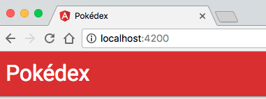

[Last time](/routing-angular-2/), we implemented our pokémon detail view by using routing to switch between the overview and the detail. However, currently we still have the same title across our entire application. Usually when you have an application with multiple pages, you want to change the page title depending on the page the user visits.

### The problem

When you're not using single page webapps, it's pretty easy to do this by just changing the `<title>` for that page. However, now that we're using [Angular 2](http://angular.io) and components, we have to look for a different solution. Our component is responsible only for a small part of the page, and it isn't responsible for the `<head>`. The proper way to implement this would be to use a service. Luckily, Angular already has such a service, called [`Title`](https://angular.io/docs/ts/latest/api/platform-browser/index/Title-class.html).

### Using `Title`

Let's open `PokemonInfoComponent` by opening **pokemon-info.component.ts**. The first step when we're using a service is to add it to the constructor. Currently I'm already using the `PokemonService` and `ActivatedRoute` services, so I just have to add another one:

```typescript
constructor(private _route: ActivatedRoute, private _service: PokemonService, private _titleService: Title) {
}
```

Obviously, we also have to import `Title`:

```typescript
import {Title} from '@angular/platform-browser';
```

### Refactoring our `ngOnInit()`

If we want to show the ID and the name of the pokémon in the title, we'll have to subscribe to the following:

```typescript
ngOnInit() {
  this._route.params
    .map(params => params['id'])
    .flatMap(id => this._service.findOne(id))
    .subscribe(pokemon => this.pokemon = pokemon);
}
```

However, currently we already have a subscriber. Either we put another line of code into the `subscribe()`, or we refactor it so that the observable itself is stored in a variable and then we subscribe to it twice:

```typescript
ngOnInit() {
  let observable = this._route.params
    .map(params => params['id'])
    .flatMap(id => this._service.findOne(id));
  observable.subscribe(pokemon => this.pokemon = pokemon);
  observable.subscribe(pokemon => this._titleService.setTitle(`#${pokemon.baseInfo.id} - ${pokemon.baseInfo.name}`));
}
```

However, if we use this code, it will actually call our service twice. To share the same observable, we have to use the [`Observable.share()`](http://reactivex.io/documentation/operators/refcount.html) operator. For example:

```typescript
ngOnInit() {
  let observable = this._route.params
    .map(params => params['id'])
    .flatMap(id => this._service.findOne(id))
    .share();
  observable.subscribe(pokemon => this.pokemon = pokemon);
  observable.subscribe(pokemon => this._titleService.setTitle(`#${pokemon.baseInfo.id} - ${pokemon.baseInfo.name}`));
}
```

### Resetting the title

We have one issue now though, when we view a pokémon and go back to our overview, the page title remains the same. We have to find a way to reset this somehow. We can either add the `Title` service to all components, but this time I want to wait until a route changes to change the title to "Pokédex".

To do that, I'm going to open **app.component.ts** and I'm going to import both `Title` and [`Router`](https://angular.io/docs/ts/latest/api/router/index/Router-class.html):

```typescript
constructor(private _titleService: Title, private _router: Router) {
    
}
```

With the `Router` we can listen to events, and one of these events is the `NavigationStart` event which will be fired when we start navigating to a specific route:

```typescript
ngOnInit() {
  this._router.events
    .filter(event => event instanceof NavigationStart)
    .subscribe(event => this._titleService.setTitle('Pokédex'));
}
```

As usual, make sure you don't forget to import both `Title`, `Router` and `NavigationStart`:

```typescript
import {Router, NavigationStart} from '@angular/router';
import {Title} from '@angular/platform-browser';
```

If we open the application now, you can see that the title is "Pokédex".



However, when we click the "View" link next to a Pokémon, we can see that the title changes for that specific Pokémon:


If you're wondering why it takes so long to show that title, well, that's because we first have to call the PokéAPI to retrieve the name of the pokémon before we can actually show it. If you don't want this delay, you should probably send that data with your route, or use a service to store that info temporarily.

Anyways, that wraps up this article. [Next time](/implementing-pipes-angular-2/) we'll talk about defining your own pipes.

#### Achievement: Master of titles

If you’re seeing this, then it means you successfully managed to make it through this tutorial. If you're interested in the code, you can check it out at [Github](https://github.com/g00glen00b/ng2-pokedex).
