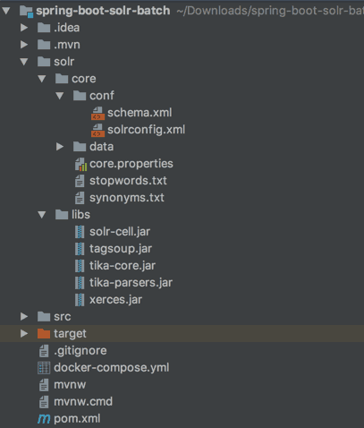
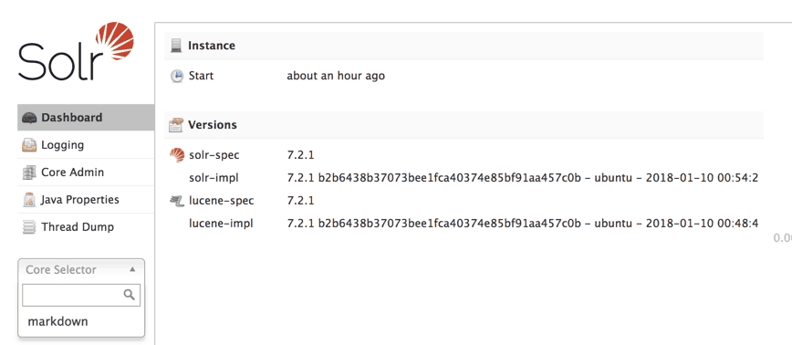

When indexing documents, [Apache Solr](http://lucene.apache.org/solr/) is a possible solution. Combined with [Apache Tika](http://tika.apache.org/), you can also use Solr to index various types of documents, such as PDFs, Word documents, HTML files, ... . In this tutorial, I'll be setting up Solr with Tika using [Docker compose](https://docs.docker.com/compose/).


### Project structure

In my case, I want to run Solr inside a Docker container next to my Java application. That means I will have the following project structure:



In this case, **src/** is the code of my Java application, while the **solr/** folder will be used for binding certain folders in my Docker container.

### Retrieving the proper dependencies

To run Solr with Apache Tika, you need the following dependencies:

- **Solr Cell**: This library contains the `ExtractingRequestHandler`, which is necessary to upload files and to work with Tika.
- **Tika Core**: The core library of Apache Tika, but doesn't contain the parsers.
- **Tika Parsers**: Additionally to the core library, you need the parsers library.

Additionally to these libraries, you may need other libraries as well, depending on the parsers you want to use. In my case, I want to use the HTML parser, so I also have to add the following dependencies:

- **Xerces**: Library to parse XML structures.
- **Tagsoup**: A library to parse HTML documents and tags.

To include these libraries, you can either download them manually and place them in **solr/libs** or you can use Maven to download them if you use the [**maven-dependency-plugin**](https://maven.apache.org/plugins/maven-dependency-plugin/):

```xml
<plugin>
    <groupId>org.apache.maven.plugins</groupId>
    <artifactId>maven-dependency-plugin</artifactId>
    <executions>
        <execution>
            <id>copy</id>
            <phase>package</phase>
            <goals>
                <goal>copy</goal>
            </goals>
            <configuration>
                <artifactItems>
                    <artifactItem>
                        <groupId>org.apache.solr</groupId>
                        <artifactId>solr-cell</artifactId>
                        <version>7.2.1</version>
                        <type>jar</type>
                        <overWrite>true</overWrite>
                        <outputDirectory>solr/libs</outputDirectory>
                        <destFileName>solr-cell.jar</destFileName>
                    </artifactItem>
                    <artifactItem>
                        <groupId>org.apache.tika</groupId>
                        <artifactId>tika-core</artifactId>
                        <version>1.17</version>
                        <type>jar</type>
                        <overWrite>true</overWrite>
                        <outputDirectory>solr/libs</outputDirectory>
                        <destFileName>tika-core.jar</destFileName>
                    </artifactItem>
                    <artifactItem>
                        <groupId>org.apache.tika</groupId>
                        <artifactId>tika-parsers</artifactId>
                        <version>1.17</version>
                        <type>jar</type>
                        <overWrite>true</overWrite>
                        <outputDirectory>solr/libs</outputDirectory>
                        <destFileName>tika-parsers.jar</destFileName>
                    </artifactItem>
                    <artifactItem>
                        <groupId>xerces</groupId>
                        <artifactId>xercesImpl</artifactId>
                        <version>2.11.0</version>
                        <type>jar</type>
                        <overWrite>true</overWrite>
                        <outputDirectory>solr/libs</outputDirectory>
                        <destFileName>xerces.jar</destFileName>
                    </artifactItem>
                    <artifactItem>
                        <groupId>org.ccil.cowan.tagsoup</groupId>
                        <artifactId>tagsoup</artifactId>
                        <version>1.2</version>
                        <type>jar</type>
                        <overWrite>true</overWrite>
                        <outputDirectory>solr/libs</outputDirectory>
                        <destFileName>tagsoup.jar</destFileName>
                    </artifactItem>
                </artifactItems>
                <overWriteReleases>false</overWriteReleases>
                <overWriteSnapshots>true</overWriteSnapshots>
            </configuration>
        </execution>
    </executions>
</plugin>
```

### Configuring your Solr core

By default, Solr within Docker will load cores automatically if placed within the **/opt/solr/server/solr/** folder. I'm going to use a [bind mount](https://docs.docker.com/storage/bind-mounts/) to pass the local **solr/core** folder to a subfolder within the `/opt/solr/server/solr/` folder.

So, within my project, I created a folder called **solr/core/conf** and added the **solrconfig.xml** file:

```xml
<?xml version="1.0" encoding="UTF-8" ?>
<config>
    <luceneMatchVersion>6.0.0</luceneMatchVersion>
    <directoryFactory name="DirectoryFactory" class="${solr.directoryFactory:solr.StandardDirectoryFactory}"/>
    <dataDir>${solr.markdown.data.dir:}</dataDir>
    <schemaFactory class="ClassicIndexSchemaFactory"/>
    <lib dir="../../solr-cell/" regex=".*.jar" />

    <updateHandler class="solr.DirectUpdateHandler2">
        <updateLog>
            <str name="dir">${solr.markdown.data.dir:}</str>
        </updateLog>
    </updateHandler>

    <requestDispatcher>
        <requestParsers enableRemoteStreaming="false" multipartUploadLimitInKB="-1" formdataUploadLimitInKB="-1" />
    </requestDispatcher>

    <requestHandler name="/select" class="solr.SearchHandler"/>

    <requestHandler name="/update/extract" class="org.apache.solr.handler.extraction.ExtractingRequestHandler">
        <lst name="defaults">
            <str name="fmap.Last-Modified">last_modified</str>
            <str name="fmap.content">content</str>
            <str name="uprefix">ignored_</str>
        </lst>
    </requestHandler>

    <admin>
        <defaultQuery>solr</defaultQuery>
    </admin>

    <initParams path="/select">
        <lst name="defaults">
            <str name="df">content</str>
            <str name="q.op">OR</str>
        </lst>
    </initParams>
</config>
```

What's important to notice here is that I'll be including libraries from the `../../solr-cell/` folder. This will be another bind mount within the Docker container, referencing the **solr/libs** folder that I defined earlier. Another thing to notice is the request handler for `/update/extract`. This is the Solr cell request handler that can be used to index PDF files, Word documents, ... .

Additionally to that, you can see that I configured the default operator to be `OR` and the default field to be `content`. In previous versions of Solr, you could do that within the `schema.xml` file, but now this has to be configured as default parameters within `solrconfig.xml`.

### Configuring a schema

When using Solr cell, you can pretty much chose the fields you want by yourself. I configured the `content` field to contain the indexed document, the `Last-Modified` field to contain the last modification date of the document within Solr and I added a dynamic field for the `ignored_` prefix. This allows me to skip storing certain fields that are provided by Solr Cell.

This file has to be configured within the same folder as before, meaning that you should put it within the \*\*\*\*solr/core/conf\*\* folder.

```xml
<?xml version="1.0" ?>
<schema name="markdown" version="1.1">
    <types>
        <fieldType name="key" class="solr.StrField" sortMissingLast="true" omitNorms="true"/>
        <fieldType name="long" class="solr.LongPointField" />
        <fieldType name="date" class="solr.DatePointField" />
        <fieldType name="text_general" class="solr.TextField" positionIncrementGap="100">
            <analyzer type="index">
                <tokenizer class="solr.StandardTokenizerFactory"/>
                <filter class="solr.StopFilterFactory" ignoreCase="true" words="stopwords.txt" />
                <filter class="solr.LowerCaseFilterFactory"/>
            </analyzer>
            <analyzer type="query">
                <tokenizer class="solr.StandardTokenizerFactory"/>
                <filter class="solr.StopFilterFactory" ignoreCase="true" words="stopwords.txt" />
                <filter class="solr.SynonymFilterFactory" synonyms="synonyms.txt" ignoreCase="true" expand="true"/>
                <filter class="solr.LowerCaseFilterFactory"/>
            </analyzer>
        </fieldType>
    </types>

    <fields>
        <field name="file.id" type="key" indexed="true" stored="true"/>
        <field name="_version_" type="long" indexed="true" stored="true"/>
        <field name="title" type="text_general" indexed="true" stored="true"/>
        <field name="subject" type="text_general" indexed="true" stored="true"/>
        <field name="content" type="text_general" indexed="true" stored="true"/>
        <field name="page" type="long" indexed="true" stored="true"/>
        <field name="last_modified" type="date" indexed="true" stored="true" default="NOW"/>
        <dynamicField name="ignored_*" type="text_general" indexed="false" stored="false"/>
    </fields>

    <uniqueKey>file.id</uniqueKey>
</schema>
```

What's important to notice here is that I'm using the `StopFilterFactory` and the `SynonymFilterFactory`, which means you need to define a `stopwords.txt` and `synonyms.txt` file. For example, you can use the [CoreNLP stopwords.txt file](https://github.com/stanfordnlp/CoreNLP/blob/master/data/edu/stanford/nlp/patterns/surface/stopwords.txt). An example of the `synonyms.txt` syntax can be found within the [Solr GitHub project itself](https://github.com/apache/lucene-solr/blob/master/solr/server/solr/configsets/sample_techproducts_configs/conf/synonyms.txt). These files have to be stored within the **solr/core** folder.

Additionally, if you want to properly debug what's happening, you may want to change the `indexed` and `stored` attributes of the `ignored_` field to `true`. This gives you a better overview of what happened behind the screens and what parsers were used:

```xml
<dynamicField name="ignored_*" type="text_general" indexed="true" stored="true"/>
```

If you're using older versions of Solr, you may want to replace the `solr.LongPointField` and `solr.DatePointField` fields by `solr.TrieLongField` and `solr.TrieDateField` respectively.

### Using Docker Compose

Configuring Docker compose happens through the configuration of a YAML file called `docker-compose.yml`. In my case, I'm going to use the [official Solr image](https://hub.docker.com/_/solr/), make the 8983 port publicly available and bind two folders to the Docker container:

1. **./solr/core** to the **/opt/solr/server/solr/markdown/** folder. I named my core "markdown" because I'll use it to index Markdown files. If you want to name your core differently, feel free to do so. Make sure to change the `${solr.markdown.data.dir:}` property within `solrconfig.xml` and the `name` attribute of the `<schema>` element within `schema.xml` as well.
2. **./solr/libs** to the **/opt/solr/server/solr-cell/** folder. This location can be changed as well, but if you do so, you need to change the `<lib>` element of `solrconfig.xml` to match the new location.

My Docker compose configuration looks like this:

```yaml
version: '3.1'

services:
  solr:
    image: solr
    ports:
      - "8983:8983"
    volumes:
      - ./solr/core/:/opt/solr/server/solr/markdown/
      - ./solr/libs/:/opt/solr/server/solr-cell/
```

### Running the project

To run the project, you can use the `docker-compose up` command. After a while, Solr should have been started. You can now take a look at the Solr dashboard at [http://localhost:8983/solr](http://localhost:8983/solr/) which should have loaded your core:



### Configuring Tika

If, for some reason you want to configure Tika using the [XML configuration format](https://tika.apache.org/1.17/configuring.html#Using_a_Tika_Configuration_XML_file), you can do this by adding a file called **tika-config.xml** to the **solr/core/conf** folder (next to `solrconfig.xml` and `schema.xml`). To load this configuration, you have to define another `<initParams>` element within `solrconfig.xml`:

```xml
<initParams path="/update/extract">
    <str name="tika.config">tika-config.xml</str>
</initParams>
```

This will properly load the Tika configuration file when Solr starts. For more configuration properties you can take a look at [this Solr guide](https://lucene.apache.org/solr/guide/6_6/uploading-data-with-solr-cell-using-apache-tika.html#UploadingDatawithSolrCellusingApacheTika-ConfiguringtheSolrExtractingRequestHandler).

If you're seeing this, it means you're now running Solr in a containerized world! If you don't see this, or you're lazy, you can find the full code at [GitHub](https://github.com/g00glen00b/spring-samples/tree/master/spring-boot-solr-batch).
