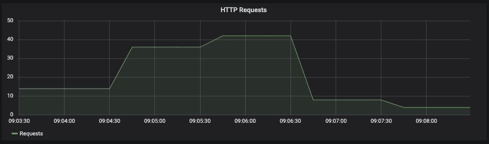

A while ago, I wrote [a tutorial about deploying your static web project on nginx using Docker](/containerizing-your-static-web-project/). Today, we'll go a bit further, and see how we can monitor what's happening on [nginx](https://www.nginx.com/), by using [Prometheus](https://prometheus.io/) and [Grafana](https://grafana.com/).


### Enabling the status endpoint

nginx itself already comes with a status endpoint on its own, which can be enabled using the [ngx\_http\_stub\_status\_module](http://nginx.org/en/docs/http/ngx_http_stub_status_module.html). To do this, we have to open our **nginx.conf** and add a separate location:

```nginx
http {
    index   index.html;
    server {
        location /metrics {
            stub_status on;
        }
    }
}

```

Using this configuration, we'll have an endpoint **/metrics** that will provide us with some information, for example:

```
Active connections: 5 
server accepts handled requests
 5 5 55 
Reading: 0 Writing: 1 Waiting: 4 
```

### Using the Prometheus exporter

While it's already great that we have some metrics now, they aren't ready to be consumed by Prometheus. In order to do that, we have to create a Prometheus-readable endpoint that provides these metrics.

One of the tools we can use to do this is the [nginx-prometheus-exporter](https://github.com/nginxinc/nginx-prometheus-exporter), which can be ran using Docker, for example:

```
docker run \
  -p 9113:9113 \
  nginx/nginx-prometheus-exporter:0.2.0 \
  -nginx.scrape.uri=http://path-to-nginx/metrics \
  -nginx.retries=10 \
  -web.telemetry-path=/prometheus
```

If you're using Docker Compose or Kubernetes, you can also set these configuration parameters through environment variables. In that case, `SCRAPE_URI` matches `-nginx.scrape.uri`, `TELEMETRY_PATH` matches `-web.telemetry-path` and `NGINX_RETRIES` matches `nginx.retries`.

Another important note is that if you don't configure the amount of retries, this will likely not work, as by default it won't retry. This means that if you use Docker compose to start both nginx and the exporter at the same time, the exporter will be killed immediately because it can't find nginx.

### Configuring Prometheus

The next step to get this running is to configure Prometheus properly by adding a target to `prometheus.yml`. For example:

```yaml
scrape_configs:
  - job_name: 'movie-quote-consumer'
    scrape_interval: 1m
    metrics_path: '/prometheus'
    static_configs:
      - targets: ['movie-quote-consumer-prometheus:9113']
```

In this example, I'm running the Prometheus exporter as a container within the same network as Prometheus, and I'm using the `movie-quote-consumer-prometheus:9113` alias to connect to it.

Once your containers are running, you should be able to see whether or not Prometheus is configured properly by visiting the **/targets** endpoint. This should show the status **UP** next to the **movie-quote-consumer** job.


### Configuring Grafana

Once you've set up Grafana to connect to the Prometheus database, you can set up some dashboards. In this case, I want to show a graph of the total amount of connections that have been made by checking the `nginx_http_requests_total` property.

Since this property shows a total amount of requests, and I only want to see the total amount of requests for a given time, I need to use the `delta()` function to measure the difference between certain measurements. For example, if you want to calculate the total amount of requests over a time span of two minutes, you can use:

```
delta(nginx_http_requests_total{job="movie-quote-consumer"}[2m])
```

This will result in a graph like this:



And there you have it, a nice dashboard for nginx. The great thing about this is that if you have **nginx plus**, the configuration barely changes. You only have to enable the Prometheus exporter to collect metrics for nginx plus by using the `-nginx.plus` flag. After that, you should be able to use the new metrics within Grafana.
