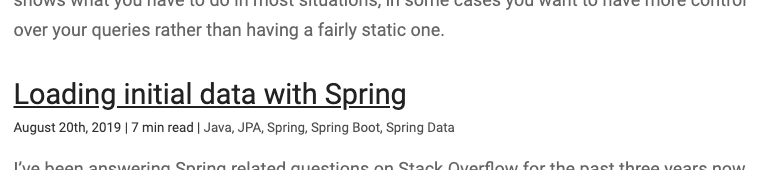

In [my latest tutorials](/tag/gatsby), I've explored how to create a blog with Gatsby using WordPress as a headless CMS. In this tutorial, I'll explain how you can implement a "reading time" feature with Gatsby.


### Reading time with Markdown

With Markdown, adding the reading time isn't difficult. Just add the following plugins to parse your Markdown as HTML, and to add the reading time to the GraphQL API:

```
npm install gatsby-transformer-remark gatsby-remark-reading-time --save
```

Once installed, you can add `gatsby-remark-reading-time` as a plugin for `gatsby-transformer-remark`:

```javascript
{
  resolve: `gatsby-transformer-remark`,
  options: {
    plugins: [
      `gatsby-remark-reading-time`,
    ],
  },
}
```

By adding this plugin, the `readingTime` property will be available to use within the GraphQL API. For example:

```graphql
{
  allMarkdownRemark {
    edges {
      node {
        html
        excerpt(pruneLength: 200)
        frontmatter {
          title
          date(formatString: "MMMM Do, YYYY")
        }
        fields {
          readingTime {
            text
          }
        }
      }
    }
  }
}
```

### Reading time with WordPress

With `gatsby-source-wordpress`, there are a few options when it comes to integrating the reading time into our application. If we want to do things ourself, we can use the [reading-time library](https://github.com/ngryman/reading-time). This is the same library used by the `gatsby-remark-reading-time` plugin.

```
npm install gatsby-source-wordpress reading-time --save
```

#### Using a normalizer

We have two separate methods of integrating this library into our Gatsby data. First of all, the `gatsby-source-wordpress` plugin comes with a `normalizer` function. We can use this function to change the nodes before they end up in the GraphQL API.

After configuring the Gatsby WordPress plugin, you can add a `normalizer` to transform the entities. For example:

```javascript
{
  resolve: `gatsby-source-wordpress`,
  options: {
    // ...
    normalizer: ({entities}) => entities.map(entityWithReadingTime)
  }
}
```

The `normalizer` parameter expects a function that returns the normalized entities. Additionally, it passes a parameter that contains the original `entities` as a field.

All we have to do is map each entity by using a function, such as `entityWithReadingTime`:

```javascript
const readingTime = require('reading-time');

const entityWithReadingTime = ({content, ...rest}) => ({
  content,
  readingTime: content != null && readingTime(content),
  ...rest
});
```

This function will transform every entity that has a `content` to also include a `readingTime` field.

If we run the application now, we can use the following GraphQL query to retrieve the reading time information for every post:

```graphql
{
  allWordpressPost {
    edges {
      node {
        title
        excerpt
        slug
        date(formatString: "MMMM Do, YYYY")
        readingTime {
          text
        }
      }
    }
  }
}
```

Like before, the reading time will be available within your data.



#### Using `onCreateNode`

Another possibility, if you don't like the `normalizer` option, is by using the `onCreateNode` hook provided by the Gatsby Node API.

To do this, we can add the following code to **gatsby-node.js**:

```javascript
const readingTime = require('reading-time');

exports.onCreateNode = ({ node, actions }) => {
  const { createNodeField } = actions;
  if (node.content != null) {
    createNodeField({
      node,
      name: 'readingTime',
      value: readingTime(node.content)
    });
  }
}
```

Like the other Gatsby Node APIs, we get an `actions` object containing operations. A useful action, in this case, is the `createNodeField` action. We can use this operation to extend the existing node.

One difference with the previous method is that we now have to retrieve the `readingTime` property from `fields` in GraphQL:

```graphql
{
  allWordpressPost {
    edges {
      node {
        title
        excerpt
        slug
        date(formatString: "MMMM Do, YYYY")
        fields {
          readingTime {
            text
          }
        }
      }
    }
  }
}
```

One advantage of using this method is that other plugins can't override the `readingTime` field.

#### Using a plugin

Using the method provided earlier, I created the `[gatsby-wordpress-reading-time](https://github.com/g00glen00b/gatsby-wordpress-reading-time)` [plugin](https://github.com/g00glen00b/gatsby-wordpress-reading-time). All you have to do is to install it:

```
npm install gatsby-source-wordpress gatsby-wordpress-reading-time --save
```

After that, you can enable it by adding it as a plugin for `gatsby-source-wordpress`:

```javascript
module.exports = {
  plugins: [
    {
      resolve: `gatsby-source-wordpress`,
      options: {
        // Other options ...
        plugins: [
          `gatsby-wordpress-reading-time`,
        ]
      }
    },
  ]
};
```

And there you have it, you're now able to show the estimated reading time for both Markdown as WordPress posts.

If you're interested in the full code, you can check the reading time plugin on [GitHub](https://github.com/g00glen00b/gatsby-wordpress-reading-time). Additionally, you can see it in action within the [source code of my blog](https://github.com/g00glen00b/gatsby-blog).
