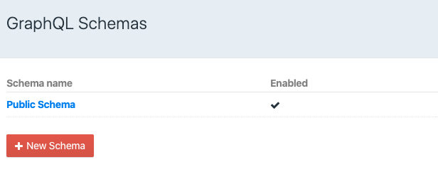
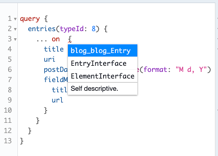
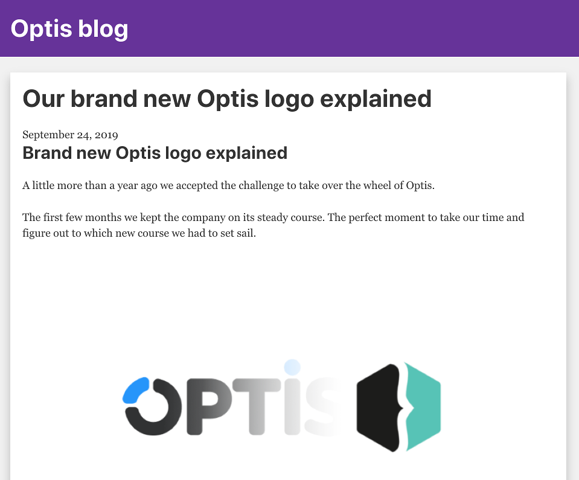

The last few weeks, I've covered how to [use Gatsby with WordPress](https://wordpress.g00glen00b.be/using-gatsby-with-wordpress-as-a-headless-cms/), and with [JSON files](https://wordpress.g00glen00b.be/using-json-with-gatsby/). Today, I'm going to show you how you can use Gatsby with [Craft CMS](https://craftcms.com/).

Craft CMS is a flexible, feature-rich content management system. One of the major differences between WordPress and Craft CMS is that the latter relies on matrix fields in stead of a regular WYSIWYG editor. This allows you to add multiple types of content to a single post.  
In addition, it doesn't rely on certain templates like WordPress does, and thus, gives designers and developers more of a clean slate when it comes to customization.  
Another nice thing is that it comes with [GraphQL](https://graphql.org/) support out of the box. That means we can easily integrate it with [Gatsby](https://www.gatsbyjs.org/).


### Configuring the GraphQL schema

By default, Craft CMS already exposes a public GraphQL schema to the public. This schema only exposes a "ping" endpoint, and wouldn't be useful for our purpose.  
To configure what's exposed, you first have to go to the Craft CMS dashboard. Within the dashboard, you have to select **GraphQL** and then **Schemas**. In here, you can either select the **Public Schema**, or create a new one and apply authentication.



After selecting or creating a schema, you can change the exact scope of what's being exposed. In my case, I've exposed all blog entry types, and the assets.  
Once changed, you can try writing a query by going to **GraphQL** and then selecting **Explore**.

The queries you can execute, depend mostly on what you enabled, and what type of entities you use on Craft CMS. In my case, I can fetch all blogposts with their featured image by using the following query:

```
query {
  entries(typeId: 8) {
    ... on blog_blog_Entry {
      title
      uri
      postDate @formatDateTime(format: "M d, Y")
      fieldMedia {
        title
        url
      }
    }
  }
}
```

Important to know is that the type `blog_blog_Entry` depends on what entry types you declared. Normally, Craft CMS will provide an autocomplete containing which types are available.



Now that you know how to change the schema and execute queries, it's time to get started with Gatsby.

### Setting up a Gatsby project

As usual, a new Gatsby project can be created with the Gatsby CLI:

```
gatsby new my-craft-cms-blog
```

After the CLI created your project, we first have to install the `gatsby-source-graphql` dependency. This dependency allows us to use third-party GraphQL schemas with Gatsby.

```
cd my-craft-cms-blog
npm install --save gatsby-source-graphql
```

After that, you're ready to start developing.

### Configuring Gatsby

The first step when setting up Gatsby, is to configure the plugins you're using. Since we just installed the `gatsby-source-graphql` plugin, we'll have to configure it first.  
To do this, open **gatsby-config.js**. In here, add a new entry to the **plugins** section. For example:

```
{
  resolve: `gatsby-source-graphql`,
  options: {
    typeName: 'CraftAPI',
    fieldName: 'craftAPI',
    url: 'https://example.org/actions/graphql/api'
  }
}
```

In case you're using a private schema, you'll have to copy over the access token, and use it like this:

```
{
  resolve: `gatsby-source-graphql`,
  options: {
    typeName: 'CraftAPI',
    fieldName: 'craftApi',
    url: 'https://example.org/actions/graphql/api',
    headers: {
      Authorization: `Bearer ${process.env.AUTHENTICATION_TOKEN}`
    }
  }
}
```

Now you'll be able to run the application using `npm start`. If you're using an authentication token, you can use:

```
AUTHENTICATION_TOKEN=my-token npm start
```

### Creating an index page

Once you've set up your Gatsby project, and it's up and running, it's time to explore the page components. By default, you'll get an **index.js** and a **page-2.js** file within the **src/pages** folder.

We don't really need the "page-2.js" file, so let's look at the "index.js" page in stead. By default, it has some dummy content, but in our case, we would prefer to show a list of all of our Craft CMS entries.

To do this, we can write a query like this:

```
const allEntriesQuery = graphql`
  {
    craftApi {
      entries {
        ... on CraftAPI_blog_blog_Entry {
          id
          title 
          uri
          postDate
          fieldMedia {
            url
          }   
        }
      }
    }
  }
`;
```

This query looks almost identical to the one we used before. One important difference is that you'll have to use the name configured within `fieldName` as the operation you want to use. In my case, I configured it as `craftApi`, and thus, I have to call it that way.

Additionally, Gatsby prefixes all types using the `typeName` configuration. In my case, I called it `CraftAPI` and thus, `blog_blog_Entry` now became `CraftAPI_blog_blog_Entry`.

To actually use the query within the index page, we can use the `useStaticQuery()` React hook. This hook is provided by Gatsby, and will return the response of the call.

In my case, I'm interested in looping over all `entries`, and thus I wrote the following within the `IndexPage` component:

```
const {craftApi: {entries}} = useStaticQuery(allEntriesQuery);
```

Once done, you can use the entries in a normal React component. For example, I defined a `<Post/>` component, and called it like this:

```
{entries.map(({id, title, uri, postDate, fieldMedia: [{url: mediaUrl} = {}] = []}) => <Post
  key={id}
  title={title}
  uri={uri}
  postDate={postDate}
  mediaUrl={mediaUrl}
/>)}
```

Sadly, directives from the original schema aren't stitched together with the schema provided by Gatsby, and thus, the `@formatDateTime` directive can't be used. Neither does Gatsby recognize this field as a date type, and thus Gatsby's date filtering doesn't work here either.

In my case, I ended up using `Intl.DateTimeFormat()` to format the given date. Libraries like [Moment.js](https://momentjs.com/) could also solve this problem for you, but are a bit more heavy-weight.

```
const dateFormat = new Intl.DateTimeFormat('en-US', {
  year: 'numeric',
  month: 'long',
  day: 'numeric'
});

export const Post = ({title, uri, postDate, mediaUrl}) => (
  <Link to={uri}>
    
    <h2>{title}</h2>
    <time>{dateFormat.format(new Date(postDate))}</time>
  </Link>
);
```

If you're done with the component, and you add some CSS, you could end up with a result like this:


This is a copy of the blogposts from the website of the comany I work for, [optis.be](https://www.optis.be/blog).

If you're experiencing any diffulties when fetching the `fieldMedia` field, make sure that you enabled retrieving assets within the GraphQL schema.

### Adding new pages

While the index page works fine now, clicking any article results in a 404 page. This happens because Gatsby isn't aware yet about the pages we want to declare.

To do this, we can use the `createPages` API within the **gatsby-node.js** file. I've explained this more in detail in [my tutorial about dynamically creating new pages](https://wordpress.g00glen00b.be/creating-pages-with-gatsby/).

In my case, I want to create a page for every blogpost, so I'll be using a similar query as I wrote before:

```
const allEntriesQuery = `
  {
    craftApiApi {
      entries {
        ... on CraftAPI_blog_blog_Entry {
          id 
          uri
        }
      }
    }
  }
`;

exports.createPages = ({graphql, actions: {createPage}}) => {
  return graphql(allEntriesQuery).then(({errors, data: {craftApi: {entries}}}) => {
    if (errors) throw new errors;
    return entries.map(({id, uri}) => createPage({
      path: uri,
      component: path.resolve('./src/templates/post.js'),
      context: {id: parseInt(id)}
    }));
  });
};
```

This setup will generate a new page for every post, based on the **src/templates/post.js** template.

### Creating the detail page

Since we don't have a detail page yet, I'm going to copy the contents of the index.js page to a new file called **src/templates/post.js**.

Now, the next step is to fetch the data. Within the index page, we used the `useStaticQuery()` React hook to get our data. This way of fetching data, will no longer work, as we're not dealing with a static query.

In this example, we'll have to fetch the entry with a given ID. With Gatsby, we can do that by exporting a field called `query`:

```
export const query = graphql`
  query ($id: [Int]) {
    craftApi {
      entries(id: $id) {
        ... on CraftAPI_blog_blog_Entry {
          title
          postDate
        }
      }
    }
  }
`;
```

The nice part about Gatsby is that it automatically injects parameters passed to the context (see `gatsby-node.js`) as a variable to the given query. In my case, I declared the `id` field onto the context, and thus, the above query will be all we need to fetch the data.

### Getting the detail blocks

As I've mentioned at the beginning of this article, the way entries are created with Craft CMS, isn't through a normal WYSIWYG editor. In stead of that, you'll have to declare various types of blocks within each entry.

To be able to create a complete remake of a detail page within Gatsby, we'll have to fetch all these blocks. We can do this by querying the `fieldContent` field within each entry. For example:

```
export const query = graphql`
  query ($id: [Int]) {
    craftApi {
      entries(id: $id) {
        ... on CraftAPI_blog_blog_Entry {
          title
          postDate
          fieldContent {
            ... on CraftAPI_fieldContent_itemTitle_BlockType {
              id
              itemTitle
            }
            ... on CraftAPI_fieldContent_itemText_BlockType {
              id
              itemText
            }
            ... on CraftAPI_fieldContent_codeBlock_BlockType {
              id
              code
            }
            ... on CraftAPI_fieldContent_itemLink_BlockType {
              id
              itemLink
            }
            ... on CraftAPI_fieldContent_itemMedia_BlockType {
              id
              itemMedia {
                title
                url
              }
            }
          }
        }
      }
    }
  }
`;
```

In this example, I'm using five different content block types, being titles, text, code, media and links.

To properly render all these different blocks, I created a new component called `<PostContent/>`, which will do the heavy lifting:

```
export const PostContent = ({fieldContent}) => (
  <>
    {fieldContent.map(({id, itemTitle, itemText, code, itemLink, title, itemMedia}) => {
      if (itemTitle != null) return <h2 key={id}>{itemTitle}</h2>;
      else if (itemText != null) return <div key={id} dangerouslySetInnerHTML={{__html: itemText}}/>;
      else if (code != null) return <pre key={id}>{code}</pre>;
      else if (itemLink != null) return <a key={id} href={itemLink}>{title}</a>;
      else if (itemMedia != null) return ;
      else return null;
    })}
  </>
);
```

Depending on which field isn't `null` (or `undefined`), we can determine the block type, and determine which tags we'll use. For example, for a title block we'll use a `<h2/>` element, for a code block a `<pre/>` element and so on.

Since the `itemText` field can contain HTML code, it's recommended to use the `dangerouslySetInnerHtml={{__html: itemText}}` attribue.

### Using the data within the post template

Earlier on, we exported a query within the post.js template. The data that is being fetched in such cases will be available as a parameter within your component.

This allows you to utilize the `<PostContent/>` component I wrote earlier on:

```
const PostPage = ({data: {craftApi: {entries: [{title, postDate, fieldContent}]}}}) => {
  return (
    <Layout>
      <SEO title={title} />
      <div className="content">
        <h1>{title}</h1>
        <time>{dateFormat.format(new Date(postDate))}</time>
        <PostContent fieldContent={fieldContent}/>
      </div>
    </Layout>
  );
};
```

If you run the application now, you'll see that clicking on a detail page results in the page properly being rendered:



And there you have it, you're now able to build a blazing fast static website on top of Craft CMS.
